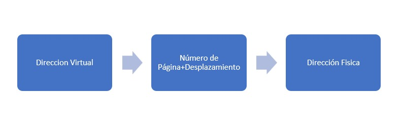
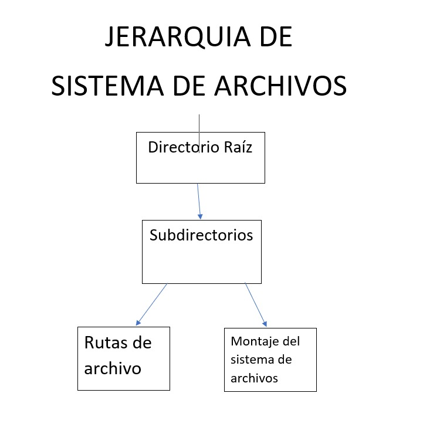

# ACTIVIDAD SISTEMAS OPERATIVOS
## Diego Ignacio Moreno Zapien

**Actividades**  
Eduardo Alcaraz  
November 27, 2024  

---

## Contents

El objetivo de estas actividades es fortalecer tu comprensión de dos áreas fundamentales en sistemas operativos: la administración de memoria y la administración de entrada/salida (E/S). Estos conceptos son esenciales para entender cómo un sistema operativo gestiona los recursos de hardware y software para garantizar el funcionamiento eficiente de un equipo de cómputo.

### ¿Qué se espera de ti?

1. **Lectura y análisis crítico:**
   - Antes de comenzar las actividades, revisa los temas relacionados en tu material de estudio o en recursos confiables. Asegúrate de comprender los conceptos clave, como memoria virtual, paginación, dispositivos de bloque y planificación de discos.
   - Reflexiona sobre cómo estos conceptos son aplicados en sistemas operativos modernos como Linux o Windows.

2. **Desarrollo práctico:**
   - Implementarás programas en lenguajes como C o Python para simular y profundizar en los mecanismos estudiados. Esto incluye la creación de algoritmos de administración de memoria y simuladores de entrada/salida.
   - Al realizar estas tareas, te familiarizarás con técnicas de programación orientadas a sistemas, como el manejo de memoria dinámica, la gestión de interrupciones y la planificación de recursos.

3. **Resolución de problemas:**
   - Las actividades incluyen preguntas teóricas y prácticas diseñadas para retarte a analizar problemas reales y proponer soluciones innovadoras.
   - Se espera que simules entornos de sistemas operativos y explores cómo interactúan sus componentes clave.

## 3. Administración de Memoria

### 3.1 Política y filosofía

#### 1. ¿Cuál es la diferencia entre fragmentación interna y externa? Explica cómo cada una afecta el rendimiento de la memoria.

La **fragmentación interna** ocurre cuando hay un espacio de memoria no utilizado dentro de una partición de memoria asignada a un proceso, debido a que el proceso no necesita toda la memoria de esa partición. Por ejemplo, si se asigna una partición de 100 KB a un proceso que solo necesita 70 KB, los 30 KB restantes son desperdiciados, causando fragmentación interna. Esto reduce la eficiencia de la memoria, ya que la memoria libre no se puede usar para otros procesos.

La **fragmentación externa** ocurre cuando hay suficiente memoria libre total, pero está distribuida en varias partes pequeñas, lo que impide que se asigne un bloque contiguo grande necesario para un proceso. Esto puede llevar a que, aunque la cantidad total de memoria libre sea suficiente, no se pueda usar para nuevos procesos, afectando el rendimiento al limitar la utilización de la memoria.

#### 2. Investiga y explica las políticas de reemplazo de páginas en sistemas operativos. ¿Cuál consideras más eficiente y por qué?

Las políticas de reemplazo de páginas se utilizan cuando la memoria principal se llena y se debe seleccionar una página para ser reemplazada. Algunas de las políticas más comunes son:

- **FIFO (First In, First Out)**: La página que ha estado más tiempo en la memoria se reemplaza primero.
- **LRU (Least Recently Used)**: Se reemplaza la página que ha sido usada menos recientemente.
- **OPT (Optimal)**: Reemplaza la página que no se usará por más tiempo en el futuro.
- **Clock (Reloj)**: Utiliza un puntero circular y reemplaza la página a la que apunta, si está marcada como no usada.

La política **LRU** es considerada más eficiente porque intenta mantener en la memoria las páginas que se han utilizado más recientemente, lo que tiene más probabilidad de ser útil en el futuro. Sin embargo, es más costosa en términos de implementación que FIFO.

### 3.2 Memoria real

#### 1. Programa en C que simule la administración de memoria mediante particiones fijas.

```c
#include <stdio.h>

#define NUM_PARTICIONES 5

void mostrar_particiones(int particiones[], int n) {
    printf("Particiones de memoria:\n");
    for (int i = 0; i < n; i++) {
        printf("Partición %d: %d KB\n", i + 1, particiones[i]);
    }
}

int main() {
    int particiones[NUM_PARTICIONES] = {100, 200, 150, 300, 250}; // Tamaño de cada partición
    int procesos[NUM_PARTICIONES] = {0}; // 0 indica que la partición está libre

    // Mostrar particiones
    mostrar_particiones(particiones, NUM_PARTICIONES);

    // Asignar procesos a las particiones
    for (int i = 0; i < NUM_PARTICIONES; i++) {
        if (procesos[i] == 0) {
            printf("\nAsignando proceso a la partición %d de %d KB\n", i + 1, particiones[i]);
            procesos[i] = 1; // Marca la partición como ocupada
        }
    }

    // Mostrar el estado de las particiones
    printf("\nEstado de las particiones:\n");
    for (int i = 0; i < NUM_PARTICIONES; i++) {
        printf("Partición %d: %s\n", i + 1, procesos[i] ? "Ocupada" : "Libre");
    }

    return 0;
}
```
### 2. Diseña un algoritmo para calcular qué procesos pueden ser asignados a un sistema con memoria real limitada utilizando el algoritmo de "primera cabida".


#### Descripción:
El algoritmo de "Primera Cabida" asigna cada proceso a la primera partición de memoria disponible que sea lo suficientemente grande para contenerlo.

#### Pseudocódigo:
```
Entrada: 
    - Lista de procesos con sus tamaños requeridos (procesos[])
    - Lista de particiones de memoria con sus tamaños disponibles (particiones[])

Salida: 
    - Lista de asignaciones de procesos a particiones.

Algoritmo:
    Para cada proceso en procesos:
        Para cada partición en particiones:
            Si la partición está libre y su tamaño >= tamaño del proceso:
                Asignar el proceso a la partición.
                Reducir el tamaño disponible de la partición.
                Marcar la partición como ocupada si es necesario.
                Romper el bucle interno.
        Si no se encuentra una partición:
            Indicar que el proceso no puede ser asignado.
    Fin Para
```

# 3.3 Organización de memoria virtual

## 1. Concepto de "paginación" y "segmentación"
### Paginación
La paginación es una técnica de administración de memoria que divide la memoria física en bloques de tamaño fijo llamados **marcos** y la memoria lógica de los procesos en bloques del mismo tamaño llamados **páginas**.

#### Ventajas:
- Elimina la fragmentación externa.
- Simplifica la asignación y liberación de memoria.

#### Desventajas:
- Puede generar fragmentación interna si las páginas no están completamente llenas.
- Introduce sobrecarga debido al uso de tablas de páginas.

### Segmentación
La segmentación divide la memoria lógica en segmentos de tamaño variable, cada uno con un propósito específico, como código, datos o pila.

#### Ventajas:
- Permite una estructura más lógica para los programas.
- Reduce la fragmentación interna.

#### Desventajas:
- Puede generar fragmentación externa.
- La administración es más compleja que en la paginación.

---

## 2. Simulación de una tabla de páginas para procesos con acceso aleatorio
```c
#include <stdio.h>
#include <stdlib.h>

#define TAMANO_MEMORIA 16
#define TAMANO_PAGINA 4

typedef struct {
    int pagina;
    int marco;
} EntradaTabla;

void inicializar_tabla(EntradaTabla tabla[], int paginas) {
    for (int i = 0; i < paginas; i++) {
        tabla[i].pagina = i;
        tabla[i].marco = rand() % (TAMANO_MEMORIA / TAMANO_PAGINA);
    }
}

void mostrar_tabla(EntradaTabla tabla[], int paginas) {
    printf("Tabla de páginas:\n");
    printf("Página\tMarco\n");
    for (int i = 0; i < paginas; i++) {
        printf("%d\t%d\n", tabla[i].pagina, tabla[i].marco);
    }
}

int main() {
    int paginas = TAMANO_MEMORIA / TAMANO_PAGINA;
    EntradaTabla tabla[paginas];
    
    inicializar_tabla(tabla, paginas);
    mostrar_tabla(tabla, paginas);
    
    return 0;
}
```
# 3.4 Administración de memoria virtual

## 1. Código que implementa el algoritmo de reemplazo de página "Least Recently Used" (LRU)
```c
#include <stdio.h>

#define MAX_PAGINAS 3

void mostrar_marcos(int marcos[], int n) {
    for (int i = 0; i < n; i++) {
        if (marcos[i] == -1) {
            printf(" _ ");
        } else {
            printf(" %d ", marcos[i]);
        }
    }
    printf("\n");
}

int encontrar_LRU(int tiempos[], int n) {
    int lru = 0;
    for (int i = 1; i < n; i++) {
        if (tiempos[i] < tiempos[lru]) {
            lru = i;
        }
    }
    return lru;
}

void LRU(int paginas[], int num_paginas) {
    int marcos[MAX_PAGINAS] = {-1, -1, -1};
    int tiempos[MAX_PAGINAS] = {0, 0, 0};
    int tiempo = 0;
    int fallos = 0;

    for (int i = 0; i < num_paginas; i++) {
        int pagina_actual = paginas[i];
        int encontrado = 0;

        for (int j = 0; j < MAX_PAGINAS; j++) {
            if (marcos[j] == pagina_actual) {
                tiempos[j] = ++tiempo;
                encontrado = 1;
                break;
            }
        }

        if (!encontrado) {
            int reemplazar = encontrar_LRU(tiempos, MAX_PAGINAS);
            marcos[reemplazar] = pagina_actual;
            tiempos[reemplazar] = ++tiempo;
            fallos++;
        }

        mostrar_marcos(marcos, MAX_PAGINAS);
    }

    printf("Fallos de página: %d\n", fallos);
}

int main() {
    int paginas[] = {7, 0, 1, 2, 0, 3, 0, 4, 2, 3, 0, 3};
    int num_paginas = sizeof(paginas) / sizeof(paginas[0]);

    printf("Simulación del algoritmo LRU:\n");
    LRU(paginas, num_paginas);

    return 0;
}
```
## 2. Diagrama del proceso de traducción de direcciones virtuales a físicas



Explicación:
1. La dirección virtual se divide en número de página y desplazamiento.
2. Se busca el marco correspondiente al número de página en la tabla de páginas.
3. Se concatena el marco con el desplazamiento para formar la dirección física.

# Integración

## 1. Análisis de la Gestión de Memoria Virtual en Linux

### Introducción
La memoria virtual es un mecanismo que permite que los programas perciban una cantidad de memoria mayor a la física disponible. Los sistemas operativos modernos, como Linux, administran la memoria virtual utilizando estrategias como paginación y segmentación.

### Gestión de Memoria Virtual en Linux
Linux utiliza un modelo basado en paginación, donde:
- **Páginas:** La memoria se divide en bloques de tamaño fijo llamados páginas (normalmente de 4 KB).
- **Espacio de direcciones:** Cada proceso tiene su propio espacio de direcciones virtuales, independiente del resto.
- **MMU (Unidad de Gestión de Memoria):** Traduce las direcciones virtuales a físicas mediante tablas de páginas.
- **Swapping:** Cuando no hay suficiente memoria física, las páginas inactivas se almacenan temporalmente en el disco (swap).

El sistema gestiona estas operaciones mediante algoritmos de reemplazo de páginas, como LRU (Least Recently Used), para decidir qué páginas mover al área de intercambio.

---

## 2. Simulación: Swapping en Memoria Virtual

A continuación, se presenta un programa en C que simula el intercambio de procesos en memoria virtual. Utiliza estructuras simples para representar procesos y su ubicación en memoria.

```c
#include <stdio.h>
#include <stdlib.h>
#include <string.h>

#define TAMANO_MEMORIA 5 // Tamaño de la memoria en "páginas"
#define TAMANO_SWAP 10   // Tamaño del área de intercambio

typedef struct {
    int id;
    char estado[10]; // "MEMORIA" o "SWAP"
} Proceso;

void mostrar(Proceso memoria[], int cant_memoria, Proceso swap[], int cant_swap) {
    printf("\n--- Memoria ---\n");
    for (int i = 0; i < cant_memoria; i++) {
        printf("Proceso %d [%s]\n", memoria[i].id, memoria[i].estado);
    }
    printf("\n--- Swap ---\n");
    for (int i = 0; i < cant_swap; i++) {
        printf("Proceso %d [%s]\n", swap[i].id, swap[i].estado);
    }
}

void intercambiar_proceso(Proceso memoria[], int *cant_memoria, Proceso swap[], int *cant_swap) {
    if (*cant_memoria == 0) {
        printf("No hay procesos en memoria para intercambiar.\n");
        return;
    }

    // Mover el primer proceso de memoria al swap
    Proceso a_intercambiar = memoria[0];
    strcpy(a_intercambiar.estado, "SWAP");
    swap[(*cant_swap)++] = a_intercambiar;

    // Compactar la memoria
    for (int i = 1; i < *cant_memoria; i++) {
        memoria[i - 1] = memoria[i];
    }
    (*cant_memoria)--;

    printf("Proceso %d movido a swap.\n", a_intercambiar.id);
}

void agregar_proceso(Proceso memoria[], int *cant_memoria, int id) {
    if (*cant_memoria >= TAMANO_MEMORIA) {
        printf("La memoria está llena, no se puede agregar el proceso %d.\n", id);
        return;
    }

    memoria[(*cant_memoria)].id = id;
    strcpy(memoria[(*cant_memoria)].estado, "MEMORIA");
    (*cant_memoria)++;
    printf("Proceso %d agregado a memoria.\n", id);
}

int main() {
    Proceso memoria[TAMANO_MEMORIA];
    Proceso swap[TAMANO_SWAP];
    int cant_memoria = 0, cant_swap = 0;

    agregar_proceso(memoria, &cant_memoria, 1);
    agregar_proceso(memoria, &cant_memoria, 2);
    agregar_proceso(memoria, &cant_memoria, 3);
    agregar_proceso(memoria, &cant_memoria, 4);
    agregar_proceso(memoria, &cant_memoria, 5);

    mostrar(memoria, cant_memoria, swap, cant_swap);

    printf("\nIntercambiando proceso...\n");
    intercambiar_proceso(memoria, &cant_memoria, swap, &cant_swap);

    mostrar(memoria, cant_memoria, swap, cant_swap);

    return 0;
}
```
# Administración de Entrada/Salida

## 4.1 Dispositivos y Manejadores de Dispositivos

### 1. Diferencia entre Dispositivos de Bloque y Dispositivos de Carácter

#### Dispositivos de Bloque
Los dispositivos de bloque son aquellos que pueden leer o escribir datos en bloques de tamaño fijo. Estos dispositivos permiten acceso aleatorio a los datos, lo que significa que se puede leer o escribir en cualquier parte del dispositivo sin necesidad de recorrer los datos secuencialmente. Ejemplos de dispositivos de bloque son los discos duros y las unidades de estado sólido (SSD).

**Ejemplo:** Un disco duro (HDD) es un dispositivo de bloque que puede almacenar datos en sectores que se acceden de manera independiente.

#### Dispositivos de Carácter
Los dispositivos de carácter son aquellos que transmiten datos de manera secuencial, es decir, un byte a la vez. No permiten acceso aleatorio a los datos, ya que la lectura o escritura se realiza de forma continua. Estos dispositivos son ideales para flujos de datos continuos como la comunicación por red o la entrada/salida de texto.

**Ejemplo:** Un teclado es un dispositivo de carácter, ya que los datos se envían de forma secuencial, un carácter a la vez.

---

### 2. Programa para un Manejador de Dispositivos de Entrada Virtual

A continuación, se presenta un programa en C que implementa un manejador de dispositivos sencillo para un dispositivo virtual de entrada. Este ejemplo simula la lectura de datos de un dispositivo de entrada y muestra cómo el manejador puede procesar estos datos.

```c
#include <stdio.h>
#include <string.h>

#define TAMANO_BUFFER 256 // Tamaño del buffer de entrada

// Estructura para representar un dispositivo de entrada virtual
typedef struct {
    char buffer[TAMANO_BUFFER];
    int tamano_actual;
} DispositivoEntrada;

// Función para inicializar el dispositivo de entrada
void inicializar_dispositivo(DispositivoEntrada *dispositivo) {
    dispositivo->tamano_actual = 0;
    memset(dispositivo->buffer, 0, TAMANO_BUFFER);
    printf("Dispositivo de entrada inicializado.\n");
}

// Función para leer datos del dispositivo
void leer_datos(DispositivoEntrada *dispositivo) {
    printf("Ingrese datos: ");
    fgets(dispositivo->buffer, TAMANO_BUFFER, stdin);
    // Eliminar el salto de línea si está presente
    if (dispositivo->buffer[strlen(dispositivo->buffer) - 1] == '\n') {
        dispositivo->buffer[strlen(dispositivo->buffer) - 1] = '\0';
    }
    dispositivo->tamano_actual = strlen(dispositivo->buffer);
}

// Función para mostrar los datos leídos
void mostrar_datos(DispositivoEntrada *dispositivo) {
    if (dispositivo->tamano_actual > 0) {
        printf("Datos leídos: %s\n", dispositivo->buffer);
    } else {
        printf("No se han leído datos.\n");
    }
}

int main() {
    DispositivoEntrada dispositivo;

    // Inicializar el dispositivo
    inicializar_dispositivo(&dispositivo);

    // Leer y mostrar datos del dispositivo
    leer_datos(&dispositivo);
    mostrar_datos(&dispositivo);

    return 0;
}
```
# 4.2 Mecanismos y Funciones de los Manejadores de Dispositivos

## 1. Interrupción por E/S y su Administración por el Sistema Operativo

### ¿Qué es la Interrupción por E/S?
La interrupción por E/S (Entrada/Salida) es un mecanismo que permite que los dispositivos de entrada y salida notifiquen al sistema operativo cuando necesitan atención. En lugar de que el sistema operativo tenga que consultar de manera continua el estado de un dispositivo (lo que se conoce como *polling*), las interrupciones permiten que el sistema responda de manera más eficiente y reactiva a los eventos de E/S.

### ¿Cómo la Administra el Sistema Operativo?
El sistema operativo administra las interrupciones mediante un componente llamado *controlador de interrupciones*, que se encarga de gestionar y responder a las interrupciones. Cuando un dispositivo emite una señal de interrupción, el procesador interrumpe su ejecución actual y guarda el estado para atender la solicitud de interrupción. El sistema operativo luego ejecuta un *manejador de interrupciones* específico para procesar la solicitud y, una vez finalizado, retorna a la tarea anterior.

### Ejemplo en Pseudocódigo para Simular Interrupciones
```pseudo
// Pseudocódigo para simular interrupciones de E/S

función manejar_interrupcion() {
    // Este es el manejador de interrupciones
    imprimir("Interrupción recibida: Procesando solicitud de E/S...");
    procesar_solicitud();
    imprimir("Interrupción procesada. Retornando al proceso anterior.");
}

función proceso_principal() {
    mientras (true) {
        imprimir("Proceso principal ejecutándose...");
        
        // Simular una interrupción
        si (condición_interrupcion) {
            manejar_interrupcion();
        }
        
        // Continuar con el proceso principal
    }
}

// Ejecutar el proceso principal
proceso_principal();
```
# Programa de Simulación de Manejo de Interrupciones

Este programa en C simula el manejo de interrupciones en un sistema básico. La simulación incluye un proceso principal que puede ser interrumpido, y un manejador de interrupciones que se activa cuando se detecta una interrupción.

```c
#include <stdio.h>
#include <stdbool.h>

bool interrupcion_detectada = false; // Variable para indicar si hay una interrupción

// Manejador de interrupciones
void manejar_interrupcion() {
    printf("Interrupción recibida: Procesando solicitud de E/S...\n");
    // Simulación del procesamiento de la solicitud de E/S
    printf("Solicitud de E/S procesada.\n");
    // Restablecer el estado de la interrupción
    interrupcion_detectada = false;
}

// Función para simular el proceso principal
void proceso_principal() {
    while (true) {
        printf("Proceso principal ejecutándose...\n");
        
        // Verificar si hay una interrupción
        if (interrupcion_detectada) {
            manejar_interrupcion();
        }

        // Simulación de la condición para detectar una interrupción (para fines de demostración)
        char entrada;
        printf("¿Detectar interrupción? (s/n): ");
        scanf(" %c", &entrada);
        if (entrada == 's') {
            interrupcion_detectada = true;
        }
    }
}

int main() {
    proceso_principal();
    return 0;
}
```
# 4.3 Estructuras de Datos para Manejo de Dispositivos

## 1. ¿Qué es una Cola de E/S?

### Definición de Cola de E/S
Una cola de E/S (Entrada/Salida) es una estructura de datos utilizada en los sistemas operativos para gestionar las solicitudes de dispositivos de entrada y salida. Estas colas permiten organizar y procesar las solicitudes en el orden en que se reciben, o en función de una prioridad específica.

Existen diferentes tipos de colas de E/S, y se utilizan principalmente para optimizar el tiempo de respuesta y la eficiencia del manejo de las solicitudes de dispositivos. Una cola de prioridad, por ejemplo, se usa para garantizar que las solicitudes más críticas sean procesadas antes que las menos importantes.

### Simulación de una Cola con Prioridad
Para simular una cola con prioridad, se puede usar una estructura de datos como una lista ordenada, donde los elementos con mayor prioridad se encuentran al frente de la cola.

**Pseudocódigo de la simulación de una cola con prioridad:**
```pseudo
estructura Solicitud {
    id: entero
    prioridad: entero
}

cola_prioridad = []

función agregar_a_cola(solicitud) {
    insertar(solicitud) en cola_prioridad en orden decreciente de prioridad
}

función procesar_solicitudes() {
    mientras (cola_prioridad no está vacía) {
        solicitud = extraer el primer elemento de la cola
        imprimir("Procesando solicitud con ID: ", solicitud.id)
    }
}
```
## 2. Programa de Simulación de Operaciones de un Manejador de Dispositivos

Este programa en C simula las operaciones de un manejador de dispositivos utilizando una tabla de estructuras para gestionar las solicitudes de los dispositivos.

```c
#include <stdio.h>
#include <string.h>

#define MAX_SOLICITUDES 5

// Estructura que representa una solicitud de dispositivo
typedef struct {
    int id;
    char tipo[20]; // Tipo de solicitud (ej. "lectura", "escritura")
    int prioridad; // Prioridad de la solicitud (1 = alta, 2 = media, 3 = baja)
} Solicitud;

// Tabla de solicitudes
Solicitud tabla_solicitudes[MAX_SOLICITUDES];
int num_solicitudes = 0;

// Función para agregar una solicitud a la tabla
void agregar_solicitud(int id, char *tipo, int prioridad) {
    if (num_solicitudes < MAX_SOLICITUDES) {
        tabla_solicitudes[num_solicitudes].id = id;
        strcpy(tabla_solicitudes[num_solicitudes].tipo, tipo);
        tabla_solicitudes[num_solicitudes].prioridad = prioridad;
        num_solicitudes++;
        printf("Solicitud ID %d agregada.\n", id);
    } else {
        printf("La tabla de solicitudes está llena.\n");
    }
}

// Función para procesar las solicitudes en orden de prioridad
void procesar_solicitudes() {
    // Ordenar las solicitudes por prioridad (menor número = mayor prioridad)
    for (int i = 0; i < num_solicitudes - 1; i++) {
        for (int j = 0; j < num_solicitudes - i - 1; j++) {
            if (tabla_solicitudes[j].prioridad > tabla_solicitudes[j + 1].prioridad) {
                // Intercambiar las solicitudes si la prioridad es mayor
                Solicitud temp = tabla_solicitudes[j];
                tabla_solicitudes[j] = tabla_solicitudes[j + 1];
                tabla_solicitudes[j + 1] = temp;
            }
        }
    }

    // Procesar y mostrar las solicitudes
    for (int i = 0; i < num_solicitudes; i++) {
        printf("Procesando solicitud ID %d, tipo: %s, prioridad: %d\n",
               tabla_solicitudes[i].id, tabla_solicitudes[i].tipo, tabla_solicitudes[i].prioridad);
    }
}

int main() {
    // Agregar algunas solicitudes de ejemplo
    agregar_solicitud(1, "lectura", 2);
    agregar_solicitud(2, "escritura", 1);
    agregar_solicitud(3, "lectura", 3);
    agregar_solicitud(4, "escritura", 1);

    // Procesar las solicitudes en orden de prioridad
    procesar_solicitudes();

    return 0;
}
```
# 4.4 Operaciones de Entrada/Salida

## 1. Flujo para la Lectura de un Archivo desde un Disco Magnético

### Descripción del Flujo
El proceso de lectura de un archivo desde un disco magnético involucra varios pasos para asegurar que los datos se transfieran de manera eficiente desde el dispositivo de almacenamiento a la memoria del sistema. A continuación, se describe el flujo de este proceso:

1. **Solicitud de Lectura**: El sistema operativo recibe una solicitud de lectura de un archivo.
2. **Localización del Archivo**: El sistema busca la ubicación del archivo en el disco.
3. **Acceso al Disco**: El disco magnético se accede para localizar la posición de los datos.
4. **Transferencia de Datos**: Los datos se leen y se transfieren a la memoria del sistema.
5. **Confirmación de Lectura**: El sistema operativo confirma que la operación de lectura se ha completado y los datos están disponibles para el proceso solicitante.

### Programa de Simulación del Proceso de Lectura

A continuación, se presenta un programa en C que simula el proceso de lectura de un archivo desde un disco magnético de manera básica:

```c
#include <stdio.h>
#include <stdlib.h>

// Simulación de la función de lectura de un archivo
void leer_archivo(const char *nombre_archivo) {
    FILE *archivo = fopen(nombre_archivo, "r"); // Abre el archivo en modo lectura

    if (archivo == NULL) {
        printf("Error: No se pudo abrir el archivo.\n");
        return;
    }

    char buffer[256]; // Buffer para almacenar los datos leídos
    printf("Lectura del archivo %s:\n", nombre_archivo);

    // Lee el contenido del archivo y lo imprime en consola
    while (fgets(buffer, sizeof(buffer), archivo) != NULL) {
        printf("%s", buffer);
    }

    fclose(archivo); // Cierra el archivo después de la lectura
    printf("\nLectura completada.\n");
}

int main() {
    const char *nombre_archivo = "ejemplo.txt"; // Nombre del archivo a leer
    leer_archivo(nombre_archivo);

    return 0;
}
```
## 2. Programa de Operaciones de Entrada/Salida Asíncronas usando Archivos

A continuación, se presenta un programa en Python que simula operaciones de entrada/salida asíncronas utilizando archivos.

```python
import asyncio

# Función asíncrona para leer un archivo
async def leer_archivo(nombre_archivo):
    print(f"Iniciando la lectura del archivo {nombre_archivo}...")
    with open(nombre_archivo, 'r') as archivo:
        contenido = archivo.read()
    print(f"Lectura del archivo {nombre_archivo} completada.")
    return contenido

# Función asíncrona para escribir en un archivo
async def escribir_archivo(nombre_archivo, contenido):
    print(f"Iniciando la escritura en el archivo {nombre_archivo}...")
    with open(nombre_archivo, 'w') as archivo:
        archivo.write(contenido)
    print(f"Escritura en el archivo {nombre_archivo} completada.")

async def main():
    # Nombres de los archivos
    archivo_entrada = 'entrada.txt'
    archivo_salida = 'salida.txt'
    
    # Realizar operaciones asíncronas
    contenido = await leer_archivo(archivo_entrada)
    await escribir_archivo(archivo_salida, contenido)

# Ejecutar el evento asíncrono principal
asyncio.run(main())
```
# Integración

El algoritmo de planificación de discos "Elevator (SCAN)" es un algoritmo de disco que simula el movimiento de un ascensor (elevator) para mover la cabeza de lectura/escritura a lo largo de la pista de un disco. El cabezal se mueve en una dirección hasta llegar al final, y luego cambia de dirección para atender las solicitudes en el sentido contrario.

## 1. Programa en C para Implementar el Algoritmo Elevator (SCAN)

```c
#include <stdio.h>
#include <stdlib.h>

// Función para implementar el algoritmo Elevator (SCAN)
void elevator_scan(int *cylinders, int num_cylinders, int initial_position, int direction) {
    int i, j, temp;
    int max_cylinder = 0, min_cylinder = 0;

    // Determinar el cilindro máximo y mínimo en la solicitud
    for (i = 0; i < num_cylinders; i++) {
        if (cylinders[i] > max_cylinder) {
            max_cylinder = cylinders[i];
        }
        if (cylinders[i] < min_cylinder || min_cylinder == 0) {
            min_cylinder = cylinders[i];
        }
    }

    // Mostrar la dirección del movimiento
    if (direction > 0) {
        printf("Movimiento hacia arriba.\n");
    } else {
        printf("Movimiento hacia abajo.\n");
    }

    // Mover la cabeza de lectura/escritura en la dirección especificada
    if (direction > 0) {
        // Mover hacia el final y luego hacia atrás
        for (i = initial_position; i <= max_cylinder; i++) {
            for (j = 0; j < num_cylinders; j++) {
                if (cylinders[j] == i) {
                    printf("Atendiendo solicitud en el cilindro %d\n", i);
                }
            }
        }
        // Cambiar la dirección y mover hacia el principio
        for (i = max_cylinder - 1; i >= min_cylinder; i--) {
            for (j = 0; j < num_cylinders; j++) {
                if (cylinders[j] == i) {
                    printf("Atendiendo solicitud en el cilindro %d\n", i);
                }
            }
        }
    } else {
        // Mover hacia el principio y luego hacia el final
        for (i = initial_position; i >= min_cylinder; i--) {
            for (j = 0; j < num_cylinders; j++) {
                if (cylinders[j] == i) {
                    printf("Atendiendo solicitud en el cilindro %d\n", i);
                }
            }
        }
        // Cambiar la dirección y mover hacia el final
        for (i = min_cylinder + 1; i <= max_cylinder; i++) {
            for (j = 0; j < num_cylinders; j++) {
                if (cylinders[j] == i) {
                    printf("Atendiendo solicitud en el cilindro %d\n", i);
                }
            }
        }
    }
}

int main() {
    int cylinders[] = {10, 22, 25, 36, 40, 45, 50};
    int num_cylinders = sizeof(cylinders) / sizeof(cylinders[0]);
    int initial_position = 30;  // Posición inicial de la cabeza de lectura/escritura
    int direction = 1;  // 1 para arriba, -1 para abajo

    elevator_scan(cylinders, num_cylinders, initial_position, direction);

    return 0;
}
```
## 1. Sistema para Manejo de Múltiples Dispositivos Simulados

Este documento describe y presenta un programa en C que simula la gestión de múltiples dispositivos (disco duro, impresora y teclado) y cómo se realiza la comunicación entre ellos.

### Diseño del Sistema

### Descripción de los Dispositivos Simulados
1. **Disco duro**: Simula la lectura y escritura de datos en un disco.
2. **Impresora**: Simula la impresión de un documento o mensaje.
3. **Teclado**: Simula la entrada de datos por parte del usuario.

#### Comunicación entre Dispositivos
Los dispositivos se comunicarán a través de una función central que coordina las operaciones y transfiere datos de un dispositivo a otro.

### Programa en C para Simular el Manejo de Múltiples Dispositivos

```c
#include <stdio.h>
#include <stdlib.h>
#include <string.h>

// Estructura para representar un dispositivo genérico
typedef struct {
    char nombre[20];
    char datos[100];
} Dispositivo;

// Función para simular la lectura de datos desde un disco duro
void leer_disco(Dispositivo *disco, const char *contenido) {
    strcpy(disco->datos, contenido);
    printf("Disco duro: Datos leídos -> %s\n", disco->datos);
}

// Función para simular la impresión de datos desde una impresora
void imprimir(Dispositivo *impresora, const char *contenido) {
    strcpy(impresora->datos, contenido);
    printf("Impresora: Imprimiendo -> %s\n", impresora->datos);
}

// Función para simular la entrada de datos desde un teclado
void leer_teclado(Dispositivo *teclado, const char *entrada) {
    strcpy(teclado->datos, entrada);
    printf("Teclado: Entrada de datos -> %s\n", teclado->datos);
}

// Función para coordinar la comunicación entre dispositivos
void comunicacion(Dispositivo *teclado, Dispositivo *disco, Dispositivo *impresora) {
    // Simula la lectura de datos desde el teclado
    leer_teclado(teclado, "Texto de prueba para imprimir");
    
    // Simula la transferencia de datos desde el teclado al disco
    leer_disco(disco, teclado->datos);

    // Simula la impresión de los datos desde el disco
    imprimir(impresora, disco->datos);
}

int main() {
    Dispositivo disco = {"Disco Duro", ""};
    Dispositivo impresora = {"Impresora", ""};
    Dispositivo teclado = {"Teclado", ""};

    // Simular la comunicación entre dispositivos
    comunicacion(&teclado, &disco, &impresora);

    return 0;
}
```
# Avanzados

Los sistemas operativos modernos implementan diversas técnicas para optimizar las operaciones de entrada/salida (E/S), y una de las más importantes es el uso de la memoria caché. Esta técnica permite mejorar significativamente el rendimiento al reducir el tiempo de acceso a los datos y disminuir la carga sobre los dispositivos de almacenamiento más lentos.

## ¿Qué es la Memoria Caché?
La memoria caché es un tipo de memoria de acceso rápido que se utiliza para almacenar temporalmente los datos que se utilizan con frecuencia. Los sistemas operativos la utilizan para almacenar datos de acceso reciente o anticipado, de modo que cuando se realiza una operación de E/S, se puede acceder a estos datos desde la caché en lugar de buscar en dispositivos de almacenamiento más lentos, como discos duros o unidades SSD.

## Cómo Optimiza la Memoria Caché las Operaciones de Entrada/Salida
1. **Reducción de la Latencia**: Cuando un programa solicita datos, el sistema operativo primero busca en la memoria caché. Si los datos están presentes (lo que se conoce como un "acierto de caché"), se pueden leer de manera casi instantánea, reduciendo la latencia de acceso.

2. **Minimización de Accesos a Disco**: Al almacenar los datos recientemente leídos o escritos en la caché, el sistema evita accesos repetidos al disco, que son mucho más lentos en comparación con el acceso a la memoria RAM. Esto reduce la carga de trabajo del disco y mejora el rendimiento general del sistema.

3. **Algoritmos de Sustitución de Caché**: Los sistemas operativos implementan algoritmos sofisticados para decidir qué datos deben mantenerse en la caché y cuáles deben ser reemplazados. Algunos de los algoritmos más comunes son:
   - **LRU (Least Recently Used)**: Reemplaza el bloque de caché que no ha sido utilizado por más tiempo.
   - **FIFO (First In, First Out)**: Reemplaza el bloque de caché más antiguo.
   - **LFU (Least Frequently Used)**: Reemplaza el bloque que se ha utilizado menos veces.

4. **Escrituras y Operaciones de E/S Asíncronas**: Las operaciones de escritura en caché pueden realizarse de manera asíncrona, lo que significa que la escritura se realiza en la caché primero y se sincroniza con el dispositivo de almacenamiento más tarde. Esto permite que el sistema continúe su operación mientras se completan las escrituras en segundo plano, mejorando la eficiencia de las operaciones de E/S.

5. **Caché de Disco y Caché de Red**: En sistemas distribuidos, se utilizan cachés de disco y cachés de red para optimizar el acceso a archivos y datos compartidos. Esto minimiza la cantidad de tráfico de red y los tiempos de espera al acceder a archivos almacenados en servidores remotos.

## Ejemplo de Optimización en la Práctica
Los sistemas de bases de datos y servidores web son ejemplos donde la caché juega un papel crucial. Cuando un servidor recibe una solicitud de un archivo o datos, primero busca en la caché del sistema. Si el archivo está en caché, se entrega al cliente rápidamente. De lo contrario, el sistema accede al disco, lo carga en la caché y lo entrega, almacenando una copia para futuras solicitudes.

## Conclusión
El uso de la memoria caché en los sistemas operativos modernos es esencial para optimizar las operaciones de entrada/salida. Permite reducir la latencia, minimizar los accesos a disco y manejar de manera más eficiente las operaciones de escritura. La implementación de algoritmos de reemplazo de caché y la escritura asíncrona son componentes clave que contribuyen a un rendimiento superior en la gestión de datos.

# Actividades: Dispositivos de Entrada y Salida en Linux

## Introducción
En este ejercicio, se explorará cómo listar, verificar y analizar los dispositivos de entrada y salida en Linux. Aprenderá a usar comandos básicos y herramientas comunes disponibles en cualquier distribución de Linux.

---

## Actividad 1: Listar dispositivos conectados

### Objetivo
Familiarizarse con los dispositivos de entrada y salida conectados al sistema y aprender a identificarlos.


## Instrucciones
Abra una terminal en su entorno Linux.
Ejecute los siguientes comandos y anote sus observaciones:

### `lsblk`: Enumera los dispositivos de bloque.

```bash
NAME   MAJ:MIN RM   SIZE RO TYPE MOUNTPOINTS
loop0    7:0    0     4K  1 loop /snap/bare/5
loop1    7:1    0 269.8M  1 loop /snap/firefox/4793
loop2    7:2    0  74.3M  1 loop /snap/core22/1564
loop3    7:3    0  10.7M  1 loop /snap/firmware-updater/127
loop4    7:4    0 505.1M  1 loop /snap/gnome-42-2204/176
loop5    7:5    0  91.7M  1 loop /snap/gtk-common-themes/1535
loop6    7:6    0  10.5M  1 loop /snap/snap-store/1173
loop7    7:7    0  38.8M  1 loop /snap/snapd/21759
loop8    7:8    0   500K  1 loop /snap/snapd-desktop-integration/178
sda      8:0    0    25G  0 disk 
├─sda1   8:1    0     1M  0 part 
└─sda2   8:2    0    25G  0 part /
sr0     11:0    1  56.9M  0 rom  /media/vboxuser/VBox_GAs_7.1.4
```
---

### `lsusb`: Lista los dispositivos conectados a los puertos USB.
```bash
Bus 001 Device 001: ID 1d6b:0002 Linux Foundation 2.0 root hub
Bus 002 Device 001: ID 1d6b:0001 Linux Foundation 1.1 root hub
Bus 002 Device 002: ID 80ee:0021 VirtualBox USB Tablet
```
---

### `lspci`: Muestra los dispositivos conectados al bus PCI.
```bash
00:00.0 Host bridge: Intel Corporation 440FX - 82441FX PMC [Natoma] (rev 02)
00:01.0 ISA bridge: Intel Corporation 82371SB PIIX3 ISA [Natoma/Triton II]
00:01.1 IDE interface: Intel Corporation 82371AB/EB/MB PIIX4 IDE (rev 01)
00:02.0 VGA compatible controller: VMware SVGA II Adapter
00:03.0 Ethernet controller: Intel Corporation 82540EM Gigabit Ethernet Controller (rev 02)
00:04.0 System peripheral: InnoTek Systemberatung GmbH VirtualBox Guest Service
00:05.0 Multimedia audio controller: Intel Corporation 82801AA AC'97 Audio Controller (rev 01)
00:06.0 USB controller: Apple Inc. KeyLargo/Intrepid USB
00:07.0 Bridge: Intel Corporation 82371AB/EB/MB PIIX4 ACPI (rev 08)
00:0b.0 USB controller: Intel Corporation 82801FB/FBM/FR/FW/FRW (ICH6 Family) USB2 EHCI Controller
00:0d.0 SATA controller: Intel Corporation 82801HM/HEM (ICH8M/ICH8M-E) SATA Controller [AHCI mode] (rev 02)
```
---

### `dmesg | grep usb`: Muestra los mensajes del kernel relacionados con dispositivos USB.
```bash
[sudo] password for vboxuser: 
[    0.352568] usbcore: registered new interface driver usbfs
[    0.352568] usbcore: registered new interface driver hub
[    0.352568] usbcore: registered new device driver usb
[    0.449637] usb usb1: New USB device found, idVendor=1d6b, idProduct=0002, bcdDevice= 6.08
[    0.449642] usb usb1: New USB device strings: Mfr=3, Product=2, SerialNumber=1
[    0.449643] usb usb1: Product: EHCI Host Controller
[    0.449644] usb usb1: Manufacturer: Linux 6.8.0-51-generic ehci_hcd
[    0.449645] usb usb1: SerialNumber: 0000:00:0b.0
[    0.545872] usb usb2: New USB device found, idVendor=1d6b, idProduct=0001, bcdDevice= 6.08
[    0.545877] usb usb2: New USB device strings: Mfr=3, Product=2, SerialNumber=1
[    0.545878] usb usb2: Product: OHCI PCI host controller
[    0.545878] usb usb2: Manufacturer: Linux 6.8.0-51-generic ohci_hcd
[    0.545879] usb usb2: SerialNumber: 0000:00:06.0
[    0.840467] usb 2-1: new full-speed USB device number 2 using ohci-pci
[    1.241949] usb 2-1: New USB device found, idVendor=80ee, idProduct=0021, bcdDevice= 1.00
[    1.241954] usb 2-1: New USB device strings: Mfr=1, Product=3, SerialNumber=0
[    1.241955] usb 2-1: Product: USB Tablet
[    1.241956] usb 2-1: Manufacturer: VirtualBox
[    1.403539] usbcore: registered new interface driver usbhid
[    1.403542] usbhid: USB HID core driver
[    1.408764] input: VirtualBox USB Tablet as /devices/pci0000:00/0000:00:06.0/usb2/2-1/2-1:1.0/0003:80EE:0021.0001/input/input6
[    1.408823] hid-generic 0003:80EE:0021.0001: input,hidraw0: USB HID v1.10 Mouse [VirtualBox USB Tablet] on usb-0000:00:06.0-1/input0
```
---

## Conteste:
### **1. Tipos de dispositivos en la salida de `lsblk`:**
La salida de `lsblk` enumera dispositivos de bloque conectados al sistema, como discos duros, particiones y dispositivos de bucle (loop). En este caso:

- **`loopX`**: Dispositivos de bucle, utilizados para montar imágenes o archivos como si fueran discos físicos. Ejemplos en la salida: `/snap/firefox/4793`, `/snap/core22/1564`, etc.
- **`sda`**: Un disco físico virtual con dos particiones:
  - **`sda1`**: Una partición de 1 MB (probablemente utilizada para datos de arranque).
  - **`sda2`**: Una partición de 25 GB montada en el sistema de archivos raíz (`/`).
- **`sr0`**: Unidad óptica virtual (CD-ROM) que contiene la imagen de las Guest Additions (`VBox_GAs_7.1.4`).

---

### **2. Diferencia entre `lsusb` y `lspci`:**

- **`lsusb`**:
  - Enumera dispositivos conectados a los puertos USB.
  - Proporciona identificadores como `idVendor` (fabricante) e `idProduct` (producto).
  - Ejemplo: Un dispositivo USB tablet conectado con `idVendor=80ee` y `idProduct=0021`.

- **`lspci`**:
  - Enumera dispositivos conectados al bus PCI, como tarjetas de red, controladores SATA y tarjetas gráficas.
  - Incluye detalles sobre el tipo de dispositivo, fabricante y modelo.
  - Ejemplo: Controlador de red `Intel Corporation 82540EM Gigabit Ethernet Controller`.

**Resumen**:  
`lsusb` se enfoca exclusivamente en dispositivos USB, mientras que `lspci` muestra dispositivos conectados al bus PCI.

---

### **3. Información adicional proporcionada por `dmesg | grep usb`:**

El comando `dmesg | grep usb` muestra mensajes del kernel relacionados con dispositivos USB. En este caso, proporciona:

1. **Registro de eventos USB**:
   - Reconocimiento de nuevos dispositivos USB conectados.
   - Ejemplo: `"New USB device found, idVendor=80ee, idProduct=0021"`.

2. **Detalles técnicos del controlador**:
   - Indica el tipo de controlador USB en uso, como:
     - `EHCI Host Controller` (para USB 2.0).
     - `OHCI PCI host controller`.

3. **Cargado de controladores**:
   - Registro de los drivers cargados para dispositivos USB, como `usbhid` (USB Human Interface Device).

4. **Asignación de dispositivos**:
   - Asigna un dispositivo a un archivo en `/dev`. Ejemplo: Dispositivo de entrada para el tablet USB: 
     `"hid-generic 0003:80EE:0021.0001"`.

**Resumen**:  
`dmesg | grep usb` proporciona una vista detallada del proceso de detección, inicialización y configuración de dispositivos USB por parte del kernel.

## Actividad 2: Verificar dispositivos de almacenamiento

## Objetivo

Aprender cómo identificar discos duros, particiones y su configuración.

## Intrucciones

Abra una terminal en su entorno Linux.
Ejecute los siguientes comandos y anote sus observaciones:

### Use el comando `fdisk -l` para listar todos los discos y particiones.
```bash
Disk /dev/loop0: 4 KiB, 4096 bytes, 8 sectors
Units: sectors of 1 * 512 = 512 bytes
Sector size (logical/physical): 512 bytes / 512 bytes
I/O size (minimum/optimal): 512 bytes / 512 bytes


Disk /dev/loop1: 269.77 MiB, 282873856 bytes, 552488 sectors
Units: sectors of 1 * 512 = 512 bytes
Sector size (logical/physical): 512 bytes / 512 bytes
I/O size (minimum/optimal): 512 bytes / 512 bytes


Disk /dev/loop2: 74.27 MiB, 77881344 bytes, 152112 sectors
Units: sectors of 1 * 512 = 512 bytes
Sector size (logical/physical): 512 bytes / 512 bytes
I/O size (minimum/optimal): 512 bytes / 512 bytes


Disk /dev/loop3: 10.72 MiB, 11239424 bytes, 21952 sectors
Units: sectors of 1 * 512 = 512 bytes
Sector size (logical/physical): 512 bytes / 512 bytes
I/O size (minimum/optimal): 512 bytes / 512 bytes


Disk /dev/loop4: 505.09 MiB, 529625088 bytes, 1034424 sectors
Units: sectors of 1 * 512 = 512 bytes
Sector size (logical/physical): 512 bytes / 512 bytes
I/O size (minimum/optimal): 512 bytes / 512 bytes


Disk /dev/loop5: 91.69 MiB, 96141312 bytes, 187776 sectors
Units: sectors of 1 * 512 = 512 bytes
Sector size (logical/physical): 512 bytes / 512 bytes
I/O size (minimum/optimal): 512 bytes / 512 bytes


Disk /dev/loop6: 10.54 MiB, 11051008 bytes, 21584 sectors
Units: sectors of 1 * 512 = 512 bytes
Sector size (logical/physical): 512 bytes / 512 bytes
I/O size (minimum/optimal): 512 bytes / 512 bytes


Disk /dev/loop7: 38.83 MiB, 40714240 bytes, 79520 sectors
Units: sectors of 1 * 512 = 512 bytes
Sector size (logical/physical): 512 bytes / 512 bytes
I/O size (minimum/optimal): 512 bytes / 512 bytes


Disk /dev/sda: 25 GiB, 26843545600 bytes, 52428800 sectors
Disk model: VBOX HARDDISK   
Units: sectors of 1 * 512 = 512 bytes
Sector size (logical/physical): 512 bytes / 512 bytes
I/O size (minimum/optimal): 512 bytes / 512 bytes
Disklabel type: gpt
Disk identifier: 74325FC8-8394-472E-B18F-11319C58F470

Device     Start      End  Sectors Size Type
/dev/sda1   2048     4095     2048   1M BIOS boot
/dev/sda2   4096 52426751 52422656  25G Linux filesystem


Disk /dev/loop8: 500 KiB, 512000 bytes, 1000 sectors
Units: sectors of 1 * 512 = 512 bytes
Sector size (logical/physical): 512 bytes / 512 bytes
I/O size (minimum/optimal): 512 bytes / 512 bytes
```

### Utilice `blkid` para ver los identificadores UUID y los tipos de sistema de archivos.
```bash
/dev/sda2: UUID="bea16ab7-3d25-45cd-a1ea-200cc4e1991d" BLOCK_SIZE="4096" TYPE="ext4" PARTUUID="017c6ca7-ec81-49bf-8af9-9da9cfe6a367"
/dev/loop1: BLOCK_SIZE="131072" TYPE="squashfs"
/dev/loop8: BLOCK_SIZE="131072" TYPE="squashfs"
/dev/loop6: BLOCK_SIZE="131072" TYPE="squashfs"
/dev/loop4: BLOCK_SIZE="131072" TYPE="squashfs"
/dev/sr0: BLOCK_SIZE="2048" UUID="2024-10-10-17-52-15-90" LABEL="VBox_GAs_7.1.4" TYPE="iso9660"
/dev/loop2: BLOCK_SIZE="131072" TYPE="squashfs"
/dev/loop0: BLOCK_SIZE="131072" TYPE="squashfs"
/dev/loop7: BLOCK_SIZE="131072" TYPE="squashfs"
/dev/sda1: PARTUUID="bcd0a217-850e-4285-9028-3c01d886b887"
/dev/loop5: BLOCK_SIZE="131072" TYPE="squashfs"
/dev/loop3: BLOCK_SIZE="131072" TYPE="squashfs"
```

### Use `df -h` para listar los dispositivos montados y su espacio disponible.
```bash
Filesystem      Size  Used Avail Use% Mounted on
tmpfs           794M  1.5M  793M   1% /run
/dev/sda2        25G  5.3G   18G  23% /
tmpfs           3.9G     0  3.9G   0% /dev/shm
tmpfs           5.0M  8.0K  5.0M   1% /run/lock
tmpfs           794M  124K  794M   1% /run/user/1000
/dev/sr0         57M   57M     0 100% /media/vboxuser/VBox_GAs_7.1.4
```

## Conteste:
### **1. ¿Qué dispositivos de almacenamiento están conectados a su sistema?**
Los dispositivos de almacenamiento detectados son:

1. **Dispositivos de bucle (`/dev/loopX`)**:
   - Usados para sistemas de archivos montados a partir de imágenes (como Snap).
   - Ejemplos: `/dev/loop0`, `/dev/loop1`, hasta `/dev/loop8`.

2. **Disco virtual principal (`/dev/sda`)**:
   - Tamaño: 25 GiB.
   - Modelo: `VBOX HARDDISK`.
   - Particiones:
     - `/dev/sda1`: 1 MiB, partición de arranque (BIOS boot).
     - `/dev/sda2`: 25 GiB, partición del sistema de archivos Linux.

3. **Unidad óptica virtual (`/dev/sr0`)**:
   - Contiene la imagen de las Guest Additions de VirtualBox (`VBox_GAs_7.1.4`).

---

### **2. ¿Qué particiones están montadas actualmente?**
Según la salida de `df -h`, las particiones montadas son:

1. **`/dev/sda2`**:
   - Montada en `/`.
   - Tamaño: 25 GiB, con 5.3 GiB usados y 18 GiB disponibles.

2. **`/dev/sr0`**:
   - Montada en `/media/vboxuser/VBox_GAs_7.1.4`.
   - Tamaño: 57 MiB (uso completo, 100%).

3. **Particiones temporales (`tmpfs`)**:
   - `tmpfs` en `/run`, `/dev/shm`, `/run/lock`, y `/run/user/1000`.

---

### **3. ¿Qué tipo de sistemas de archivos se usan en las particiones?**
Los sistemas de archivos detectados son:

1. **`ext4`**:
   - Usado en la partición principal `/dev/sda2`.

2. **`squashfs`**:
   - Usado en los dispositivos de bucle (`/dev/loopX`) para Snap.

3. **`iso9660`**:
   - Usado en la unidad óptica virtual `/dev/sr0`.

4. **`tmpfs`**:
   - Usado para sistemas de archivos temporales en memoria.

## Actividad 3: Explorar dispositivos de entrada

## Objetivo

**Identificar dispositivos como teclados, ratones y cámaras.**

## Intrucciones

### Ejecute `cat /proc/bus/input/devices` para listar los dispositivos de entrada.
```bash
I: Bus=0019 Vendor=0000 Product=0001 Version=0000
N: Name="Power Button"
P: Phys=LNXPWRBN/button/input0
S: Sysfs=/devices/LNXSYSTM:00/LNXPWRBN:00/input/input0
U: Uniq=
H: Handlers=kbd event0 
B: PROP=0
B: EV=3
B: KEY=8000 10000000000000 0

I: Bus=0019 Vendor=0000 Product=0003 Version=0000
N: Name="Sleep Button"
P: Phys=LNXSLPBN/button/input0
S: Sysfs=/devices/LNXSYSTM:00/LNXSLPBN:00/input/input1
U: Uniq=
H: Handlers=kbd event1 
B: PROP=0
B: EV=3
B: KEY=4000 0 0

I: Bus=0011 Vendor=0001 Product=0001 Version=ab41
N: Name="AT Translated Set 2 keyboard"
P: Phys=isa0060/serio0/input0
S: Sysfs=/devices/platform/i8042/serio0/input/input2
U: Uniq=
H: Handlers=sysrq kbd event2 leds 
B: PROP=0
B: EV=120013
B: KEY=402000000 3803078f800d001 feffffdfffefffff fffffffffffffffe
B: MSC=10
B: LED=7

I: Bus=0019 Vendor=0000 Product=0006 Version=0000
N: Name="Video Bus"
P: Phys=LNXVIDEO/video/input0
S: Sysfs=/devices/LNXSYSTM:00/LNXSYBUS:00/PNP0A03:00/LNXVIDEO:00/input/input4
U: Uniq=
H: Handlers=kbd event3 
B: PROP=0
B: EV=3
B: KEY=3e000b00000000 0 0 0

I: Bus=0011 Vendor=0002 Product=0006 Version=0000
N: Name="ImExPS/2 Generic Explorer Mouse"
P: Phys=isa0060/serio1/input0
S: Sysfs=/devices/platform/i8042/serio1/input/input5
U: Uniq=
H: Handlers=mouse0 event4 
B: PROP=1
B: EV=7
B: KEY=1f0000 0 0 0 0
B: REL=143

I: Bus=0003 Vendor=80ee Product=0021 Version=0110
N: Name="VirtualBox USB Tablet"
P: Phys=usb-0000:00:06.0-1/input0
S: Sysfs=/devices/pci0000:00/0000:00:06.0/usb2/2-1/2-1:1.0/0003:80EE:0021.0001/input/input6
U: Uniq=
H: Handlers=mouse1 event5 js0 
B: PROP=0
B: EV=1f
B: KEY=1f0000 0 0 0 0
B: REL=1940
B: ABS=3
B: MSC=10

I: Bus=0001 Vendor=80ee Product=cafe Version=0000
N: Name="VirtualBox mouse integration"
P: Phys=
S: Sysfs=/devices/pci0000:00/0000:00:04.0/input/input8
U: Uniq=
H: Handlers=mouse2 event6 js1 
B: PROP=0
B: EV=b
B: KEY=10000 0 0 0 0
B: ABS=3
```

### Use `evtest` para monitorear eventos de dispositivos de entrada (requiere permisos de superusuario).
```bash
No device specified, trying to scan all of /dev/input/event*
Available devices:
/dev/input/event0:	Power Button
/dev/input/event1:	Sleep Button
/dev/input/event2:	AT Translated Set 2 keyboard
/dev/input/event3:	Video Bus
/dev/input/event4:	ImExPS/2 Generic Explorer Mouse
/dev/input/event5:	VirtualBox USB Tablet
/dev/input/event6:	VirtualBox mouse integration
Select the device event number [0-6]: 
```
Investigue los siguientes dispositivos:
Teclado
```bash
Input device name: "AT Translated Set 2 keyboard"
Supported events:
  Event type 0 (EV_SYN)
  Event type 1 (EV_KEY)
    Event code 1 (KEY_ESC)
    Event code 2 (KEY_1)
    Event code 3 (KEY_2)
    Event code 4 (KEY_3)
    Event code 5 (KEY_4)
    Event code 6 (KEY_5)
    Event code 7 (KEY_6)
    Event code 8 (KEY_7)
    Event code 9 (KEY_8)
    Event code 10 (KEY_9)
    Event code 11 (KEY_0)
    Event code 12 (KEY_MINUS)
    Event code 13 (KEY_EQUAL)
    Event code 14 (KEY_BACKSPACE)
    Event code 15 (KEY_TAB)
    Event code 16 (KEY_Q)
    Event code 17 (KEY_W)
    Event code 18 (KEY_E)
    Event code 19 (KEY_R)
    Event code 20 (KEY_T)
    Event code 21 (KEY_Y)
    Event code 22 (KEY_U)
    Event code 23 (KEY_I)
    Event code 24 (KEY_O)
    Event code 25 (KEY_P)
    Event code 26 (KEY_LEFTBRACE)
    Event code 27 (KEY_RIGHTBRACE)
    Event code 28 (KEY_ENTER)
    Event code 29 (KEY_LEFTCTRL)
    Event code 30 (KEY_A)
    Event code 31 (KEY_S)
    Event code 32 (KEY_D)
    Event code 33 (KEY_F)
    Event code 34 (KEY_G)
    Event code 35 (KEY_H)
    Event code 36 (KEY_J)
    Event code 37 (KEY_K)
    Event code 38 (KEY_L)
    Event code 39 (KEY_SEMICOLON)
    Event code 40 (KEY_APOSTROPHE)
    Event code 41 (KEY_GRAVE)
    Event code 42 (KEY_LEFTSHIFT)
    Event code 43 (KEY_BACKSLASH)
    Event code 44 (KEY_Z)
    Event code 45 (KEY_X)
    Event code 46 (KEY_C)
    Event code 47 (KEY_V)
    Event code 48 (KEY_B)
    Event code 49 (KEY_N)
    Event code 50 (KEY_M)
    Event code 51 (KEY_COMMA)
    Event code 52 (KEY_DOT)
    Event code 53 (KEY_SLASH)
    Event code 54 (KEY_RIGHTSHIFT)
    Event code 55 (KEY_KPASTERISK)
    Event code 56 (KEY_LEFTALT)
    Event code 57 (KEY_SPACE)
    Event code 58 (KEY_CAPSLOCK)
    Event code 59 (KEY_F1)
    Event code 60 (KEY_F2)
    Event code 61 (KEY_F3)
    Event code 62 (KEY_F4)
    Event code 63 (KEY_F5)
    Event code 64 (KEY_F6)
    Event code 65 (KEY_F7)
    Event code 66 (KEY_F8)
    Event code 67 (KEY_F9)
    Event code 68 (KEY_F10)
    Event code 69 (KEY_NUMLOCK)
    Event code 70 (KEY_SCROLLLOCK)
    Event code 71 (KEY_KP7)
    Event code 72 (KEY_KP8)
    Event code 73 (KEY_KP9)
    Event code 74 (KEY_KPMINUS)
    Event code 75 (KEY_KP4)
    Event code 76 (KEY_KP5)
    Event code 77 (KEY_KP6)
    Event code 78 (KEY_KPPLUS)
    Event code 79 (KEY_KP1)
    Event code 80 (KEY_KP2)
    Event code 81 (KEY_KP3)
    Event code 82 (KEY_KP0)
    Event code 83 (KEY_KPDOT)
    Event code 85 (KEY_ZENKAKUHANKAKU)
    Event code 86 (KEY_102ND)
    Event code 87 (KEY_F11)
    Event code 88 (KEY_F12)
    Event code 89 (KEY_RO)
    Event code 90 (KEY_KATAKANA)
    Event code 91 (KEY_HIRAGANA)
    Event code 92 (KEY_HENKAN)
    Event code 93 (KEY_KATAKANAHIRAGANA)
    Event code 94 (KEY_MUHENKAN)
    Event code 95 (KEY_KPJPCOMMA)
    Event code 96 (KEY_KPENTER)
    Event code 97 (KEY_RIGHTCTRL)
    Event code 98 (KEY_KPSLASH)
    Event code 99 (KEY_SYSRQ)
    Event code 100 (KEY_RIGHTALT)
    Event code 102 (KEY_HOME)
    Event code 103 (KEY_UP)
    Event code 104 (KEY_PAGEUP)
    Event code 105 (KEY_LEFT)
    Event code 106 (KEY_RIGHT)
    Event code 107 (KEY_END)
    Event code 108 (KEY_DOWN)
    Event code 109 (KEY_PAGEDOWN)
    Event code 110 (KEY_INSERT)
    Event code 111 (KEY_DELETE)
    Event code 112 (KEY_MACRO)
    Event code 113 (KEY_MUTE)
    Event code 114 (KEY_VOLUMEDOWN)
    Event code 115 (KEY_VOLUMEUP)
    Event code 116 (KEY_POWER)
    Event code 117 (KEY_KPEQUAL)
    Event code 118 (KEY_KPPLUSMINUS)
    Event code 119 (KEY_PAUSE)
    Event code 121 (KEY_KPCOMMA)
    Event code 122 (KEY_HANGUEL)
    Event code 123 (KEY_HANJA)
    Event code 124 (KEY_YEN)
    Event code 125 (KEY_LEFTMETA)
    Event code 126 (KEY_RIGHTMETA)
    Event code 127 (KEY_COMPOSE)
    Event code 128 (KEY_STOP)
    Event code 140 (KEY_CALC)
    Event code 142 (KEY_SLEEP)
    Event code 143 (KEY_WAKEUP)
    Event code 155 (KEY_MAIL)
    Event code 156 (KEY_BOOKMARKS)
    Event code 157 (KEY_COMPUTER)
    Event code 158 (KEY_BACK)
    Event code 159 (KEY_FORWARD)
    Event code 163 (KEY_NEXTSONG)
    Event code 164 (KEY_PLAYPAUSE)
    Event code 165 (KEY_PREVIOUSSONG)
    Event code 166 (KEY_STOPCD)
    Event code 172 (KEY_HOMEPAGE)
    Event code 173 (KEY_REFRESH)
    Event code 183 (KEY_F13)
    Event code 184 (KEY_F14)
    Event code 185 (KEY_F15)
    Event code 217 (KEY_SEARCH)
    Event code 226 (KEY_MEDIA)
  Event type 4 (EV_MSC)
    Event code 4 (MSC_SCAN)
  Event type 17 (EV_LED)
    Event code 0 (LED_NUML) state 0
    Event code 1 (LED_CAPSL) state 0
    Event code 2 (LED_SCROLLL) state 0
Key repeat handling:
  Repeat type 20 (EV_REP)
    Repeat code 0 (REP_DELAY)
      Value    250
    Repeat code 1 (REP_PERIOD)
      Value     33
```
Mouse
 **Esa parte no me dejo copiar y pegarla ya que no podia seleccionar con el mouse**
Controladores USB adicionales
```bash
Input device name: "VirtualBox USB Tablet"
Supported events:
  Event type 0 (EV_SYN)
  Event type 1 (EV_KEY)
    Event code 272 (BTN_LEFT)
    Event code 273 (BTN_RIGHT)
    Event code 274 (BTN_MIDDLE)
    Event code 275 (BTN_SIDE)
    Event code 276 (BTN_EXTRA)
  Event type 2 (EV_REL)
    Event code 6 (REL_HWHEEL)
    Event code 8 (REL_WHEEL)
    Event code 11 (REL_WHEEL_HI_RES)
    Event code 12 (REL_HWHEEL_HI_RES)
  Event type 3 (EV_ABS)
    Event code 0 (ABS_X)
      Value      0
      Min        0
      Max    32767
    Event code 1 (ABS_Y)
      Value      0
      Min        0
      Max    32767
  Event type 4 (EV_MSC)
    Event code 4 (MSC_SCAN)
Properties:
Testing ... (interrupt to exit)
```


## Conteste:

### 1. ¿Qué eventos genera cada dispositivo al interactuar con ellos?

#### **Teclado ("AT Translated Set 2 keyboard"):**
- **Eventos admitidos:**
  - **`EV_SYN`**: Eventos de sincronización para delimitar las acciones del teclado.
  - **`EV_KEY`**: Eventos clave, correspondientes a las teclas presionadas y liberadas.
    - Cada tecla tiene un código único, como `KEY_A` para la tecla "A".
  - **`EV_MSC`**: Eventos misceláneos como `MSC_SCAN`, que identifica el escaneo de hardware.
  - **`EV_LED`**: Manejo de indicadores LED como Num Lock, Caps Lock y Scroll Lock.
- **Eventos comunes al interactuar:**
  - Presionar una tecla genera un evento `EV_KEY` con el código de la tecla (`KEY_X`) y el estado (`1` para presionada).
  - Soltar una tecla genera el mismo evento pero con estado `0`.
  - Cambiar el estado de los LEDs (por ejemplo, activar Caps Lock) genera eventos `EV_LED`.

---

#### **Mouse ("ImExPS/2 Generic Explorer Mouse"):**
- **Eventos admitidos:**
  - **`EV_SYN`**: Eventos de sincronización.
  - **`EV_KEY`**: Botones del mouse (`BTN_LEFT`, `BTN_RIGHT`, etc.).
  - **`EV_REL`**: Movimientos relativos, como desplazamiento del cursor o del scroll.
    - `REL_X` y `REL_Y`: Movimiento horizontal y vertical.
    - `REL_WHEEL`: Movimiento de la rueda del mouse.
- **Eventos comunes al interactuar:**
  - Mover el mouse genera eventos `EV_REL` con valores en `REL_X` y `REL_Y`.
  - Hacer clic en los botones genera eventos `EV_KEY` con los códigos de los botones y sus estados (1 para presionado, 0 para liberado).
  - Usar el scroll genera eventos `REL_WHEEL`.

---

#### **Controladores USB ("VirtualBox USB Tablet"):**
- **Eventos admitidos:**
  - **`EV_SYN`**: Eventos de sincronización.
  - **`EV_KEY`**: Botones del mouse (`BTN_LEFT`, `BTN_RIGHT`, etc.).
  - **`EV_REL`**: Movimientos relativos como el desplazamiento horizontal o vertical.
  - **`EV_ABS`**: Movimientos absolutos, mapeados a una pantalla virtual.
    - `ABS_X` y `ABS_Y`: Coordenadas absolutas del dispositivo.
  - **`EV_MSC`**: Eventos misceláneos como `MSC_SCAN`.
- **Eventos comunes al interactuar:**
  - Arrastrar o mover el puntero genera eventos `EV_ABS` para las coordenadas absolutas.
  - Clics en los botones generan eventos `EV_KEY`.
  - Usar el scroll puede generar eventos `EV_REL`.

---

### 2. ¿Cómo se identifican los dispositivos en `/proc/bus/input/devices`?

Cada dispositivo de entrada se identifica mediante los siguientes campos:  

- **`I` (Información del Bus):**
  - Especifica el bus al que pertenece el dispositivo, como:
    - `0019`: Dispositivos de sistema (por ejemplo, botones de encendido/suspensión).
    - `0011`: Teclado PS/2.
    - `0003`: Dispositivo USB (por ejemplo, el "VirtualBox USB Tablet").
  - Incluye el identificador de fabricante (`Vendor`) y producto (`Product`), junto con la versión del dispositivo.

- **`N` (Nombre):**
  - Nombre descriptivo del dispositivo (por ejemplo, "AT Translated Set 2 keyboard").

- **`P` (Físico):**
  - Representa la ubicación física del dispositivo en el sistema (por ejemplo, `isa0060/serio0/input0` para el teclado).

- **`S` (Sysfs):**
  - Ruta al archivo de sistema asociado al dispositivo (por ejemplo, `/devices/platform/i8042/serio0/input/input2`).

- **`U` (Unique):**
  - Identificador único del dispositivo (puede estar vacío).

- **`H` (Handlers):**
  - Interfaces asociadas para interactuar con el dispositivo, como:
    - `kbd`: Para teclados.
    - `mouseX`: Para dispositivos apuntadores.
    - `eventX`: Para eventos asociados al dispositivo.

- **`B` (Bits de propiedades):**
  - Especifican las capacidades del dispositivo, como:
    - `EV_KEY`: Manejo de teclas.
    - `EV_REL` o `EV_ABS`: Movimientos relativos o absolutos.

## Actividad 4: Examinar dispositivos de salida

## Objetivo

Entender cómo identificar dispositivos de salida como monitores y tarjetas de sonido.

## Intrucciones

### Use `xrandr` para listar las pantallas conectadas y sus resoluciones.

```bash
Screen 0: minimum 16 x 16, current 1280 x 800, maximum 32767 x 32767
Virtual-1 connected primary 1280x800+0+0 (normal left inverted right x axis y axis) 0mm x 0mm
   1280x800      59.81*+
   1024x768      59.92  
   800x600       59.86  
   640x480       59.38  
   320x240       59.52  
   1152x720      59.97  
   960x600       59.63  
   928x580       59.88  
   800x500       59.50  
   768x480       59.90  
   720x480       59.71  
   640x400       59.95  
   320x200       58.96  
   1280x720      59.86  
   1024x576      59.90  
   864x486       59.92  
   720x400       59.55  
   640x350       59.77 
```


### Ejecute `aplay -l` para listar las tarjetas de sonido disponibles.

```bash
vboxuser@uwuntu:~$ sudo aplay -l
[sudo] password for vboxuser: 
**** List of PLAYBACK Hardware Devices ****
card 0: I82801AAICH [Intel 82801AA-ICH], device 0: Intel ICH [Intel 82801AA-ICH]
  Subdevices: 1/1
  Subdevice #0: subdevice #0
```

### Use `lsof /dev/snd/*` para ver qué procesos están utilizando la tarjeta de sonido.
```bash
vboxuser@uwuntu:~$ lsof /dev/snd/*
COMMAND    PID     USER   FD   TYPE DEVICE SIZE/OFF NODE NAME
pipewire  2846 vboxuser   59u   CHR  116,1      0t0  412 /dev/snd/seq
pipewire  2846 vboxuser   60u   CHR  116,1      0t0  412 /dev/snd/seq
wireplumb 2850 vboxuser   35u   CHR  116,5      0t0  704 /dev/snd/controlC0
```

## Conteste:

### 1. **Salidas de video disponibles en el sistema**
Usando `xrandr`, se identificó una salida de video activa:

- **Salida:** `Virtual-1`  
  - **Resolución actual:** `1280x800` (establecida como principal).
  - **Resoluciones disponibles:**  
    ```
    1280x800, 1024x768, 800x600, 640x480, 320x240, 1152x720, 
    960x600, 928x580, 800x500, 768x480, 720x480, 640x400, 
    320x200, 1280x720, 1024x576, 864x486, 720x400, 640x350.
    ```

### 2. **Dispositivos de sonido detectados**
El comando `aplay -l` identificó un dispositivo de sonido:

- **Tarjeta:** `Intel 82801AA-ICH`  
  - **Dispositivo:** `Intel ICH`  
  - **Subdispositivos disponibles:** 1  
  - **Subdispositivo activo:** `subdevice #0`

### 3. **Procesos utilizando la tarjeta de sonido**
El comando `lsof /dev/snd/*` mostró que los siguientes procesos están utilizando el dispositivo de sonido:

1. **pipewire**  
   - **PID:** `2846`  
   - **Usuario:** `vboxuser`  
   - **Dispositivos utilizados:**  
     - `/dev/snd/seq` (dos instancias abiertas).

2. **wireplumber**  
   - **PID:** `2850`  
   - **Usuario:** `vboxuser`  
   - **Dispositivo utilizado:**  
     - `/dev/snd/controlC0`

## Actividad 5: Crear un script de resumen

## Objetivo

Automatizar la recopilación de información de dispositivos de entrada y salida.

## Intrucciones

### Cree un archivo llamado `dispositivos.sh` y agregue el siguiente contenido: ```bash #!/bin/bash echo "Dispositivos de bloque:" lsblk echo "Dispositivos USB:" lsusb echo "Dispositivos PCI:" lspci echo "Dispositivos de entrada:" cat /proc/bus/input/devices echo "Salidas de video:" xrandr echo "Tarjetas de sonido:" aplay -l ```
### Ejecute el script usando `bash dispositivos.sh`.
### Modifique el script para guardar la salida en un archivo llamado `resumendispositivos.txt`.

```bash
vboxuser@uwuntu:~/Desktop$ cat resumendispositivos.txt
Dispositivos de bloque:
NAME   MAJ:MIN RM   SIZE RO TYPE MOUNTPOINTS
loop0    7:0    0     4K  1 loop /snap/bare/5
loop1    7:1    0 269.8M  1 loop /snap/firefox/4793
loop2    7:2    0  74.3M  1 loop /snap/core22/1564
loop3    7:3    0  10.7M  1 loop /snap/firmware-updater/127
loop4    7:4    0 505.1M  1 loop /snap/gnome-42-2204/176
loop5    7:5    0  91.7M  1 loop /snap/gtk-common-themes/1535
loop6    7:6    0  10.5M  1 loop /snap/snap-store/1173
loop7    7:7    0  38.8M  1 loop /snap/snapd/21759
loop8    7:8    0   500K  1 loop /snap/snapd-desktop-integration/178
loop9    7:9    0  44.3M  1 loop /snap/snapd/23258
loop10   7:10   0  73.9M  1 loop /snap/core22/1722
loop11   7:11   0   568K  1 loop /snap/snapd-desktop-integration/253
loop12   7:12   0  11.1M  1 loop /snap/firmware-updater/147
sda      8:0    0    25G  0 disk 
├─sda1   8:1    0     1M  0 part 
└─sda2   8:2    0    25G  0 part /
sr0     11:0    1  56.9M  0 rom  /media/vboxuser/VBox_GAs_7.1.4

Dispositivos USB:
Bus 001 Device 001: ID 1d6b:0002 Linux Foundation 2.0 root hub
Bus 002 Device 001: ID 1d6b:0001 Linux Foundation 1.1 root hub
Bus 002 Device 003: ID 80ee:0021 VirtualBox USB Tablet

Dispositivos PCI:
00:00.0 Host bridge: Intel Corporation 440FX - 82441FX PMC [Natoma] (rev 02)
00:01.0 ISA bridge: Intel Corporation 82371SB PIIX3 ISA [Natoma/Triton II]
00:01.1 IDE interface: Intel Corporation 82371AB/EB/MB PIIX4 IDE (rev 01)
00:02.0 VGA compatible controller: VMware SVGA II Adapter
00:03.0 Ethernet controller: Intel Corporation 82540EM Gigabit Ethernet Controller (rev 02)
00:04.0 System peripheral: InnoTek Systemberatung GmbH VirtualBox Guest Service
00:05.0 Multimedia audio controller: Intel Corporation 82801AA AC'97 Audio Controller (rev 01)
00:06.0 USB controller: Apple Inc. KeyLargo/Intrepid USB
00:07.0 Bridge: Intel Corporation 82371AB/EB/MB PIIX4 ACPI (rev 08)
00:0b.0 USB controller: Intel Corporation 82801FB/FBM/FR/FW/FRW (ICH6 Family) USB2 EHCI Controller
00:0d.0 SATA controller: Intel Corporation 82801HM/HEM (ICH8M/ICH8M-E) SATA Controller [AHCI mode] (rev 02)

Dispositivos de entrada:
I: Bus=0019 Vendor=0000 Product=0001 Version=0000
N: Name="Power Button"
P: Phys=LNXPWRBN/button/input0
S: Sysfs=/devices/LNXSYSTM:00/LNXPWRBN:00/input/input0
U: Uniq=
H: Handlers=kbd event0 
B: PROP=0
B: EV=3
B: KEY=8000 10000000000000 0

I: Bus=0019 Vendor=0000 Product=0003 Version=0000
N: Name="Sleep Button"
P: Phys=LNXSLPBN/button/input0
S: Sysfs=/devices/LNXSYSTM:00/LNXSLPBN:00/input/input1
U: Uniq=
H: Handlers=kbd event1 
B: PROP=0
B: EV=3
B: KEY=4000 0 0

I: Bus=0011 Vendor=0001 Product=0001 Version=ab41
N: Name="AT Translated Set 2 keyboard"
P: Phys=isa0060/serio0/input0
S: Sysfs=/devices/platform/i8042/serio0/input/input2
U: Uniq=
H: Handlers=sysrq kbd event2 leds 
B: PROP=0
B: EV=120013
B: KEY=402000000 3803078f800d001 feffffdfffefffff fffffffffffffffe
B: MSC=10
B: LED=7

I: Bus=0019 Vendor=0000 Product=0006 Version=0000
N: Name="Video Bus"
P: Phys=LNXVIDEO/video/input0
S: Sysfs=/devices/LNXSYSTM:00/LNXSYBUS:00/PNP0A03:00/LNXVIDEO:00/input/input4
U: Uniq=
H: Handlers=kbd event3 
B: PROP=0
B: EV=3
B: KEY=3e000b00000000 0 0 0

I: Bus=0011 Vendor=0002 Product=0006 Version=0000
N: Name="ImExPS/2 Generic Explorer Mouse"
P: Phys=isa0060/serio1/input0
S: Sysfs=/devices/platform/i8042/serio1/input/input5
U: Uniq=
H: Handlers=mouse0 event4 
B: PROP=1
B: EV=7
B: KEY=1f0000 0 0 0 0
B: REL=143

I: Bus=0001 Vendor=80ee Product=cafe Version=0000
N: Name="VirtualBox mouse integration"
P: Phys=
S: Sysfs=/devices/pci0000:00/0000:00:04.0/input/input8
U: Uniq=
H: Handlers=mouse2 event6 js1 
B: PROP=0
B: EV=b
B: KEY=10000 0 0 0 0
B: ABS=3

I: Bus=0003 Vendor=80ee Product=0021 Version=0110
N: Name="VirtualBox USB Tablet"
P: Phys=usb-0000:00:06.0-1/input0
S: Sysfs=/devices/pci0000:00/0000:00:06.0/usb2/2-1/2-1:1.0/0003:80EE:0021.0002/input/input9
U: Uniq=
H: Handlers=mouse1 event5 js0 
B: PROP=0
B: EV=1f
B: KEY=1f0000 0 0 0 0
B: REL=1940
B: ABS=3
B: MSC=10


Salidas de video:
Screen 0: minimum 16 x 16, current 1280 x 800, maximum 32767 x 32767
Virtual-1 connected primary 1280x800+0+0 (normal left inverted right x axis y axis) 0mm x 0mm
   1280x800      59.81*+
   1024x768      59.92  
   800x600       59.86  
   640x480       59.38  
   320x240       59.52  
   1152x720      59.97  
   960x600       59.63  
   928x580       59.88  
   800x500       59.50  
   768x480       59.90  
   720x480       59.71  
   640x400       59.95  
   320x200       58.96  
   1280x720      59.86  
   1024x576      59.90  
   864x486       59.92  
   720x400       59.55  
   640x350       59.77  

Tarjetas de sonido:
**** List of PLAYBACK Hardware Devices ****
card 0: I82801AAICH [Intel 82801AA-ICH], device 0: Intel ICH [Intel 82801AA-ICH]
  Subdevices: 1/1
  Subdevice #0: subdevice #0

```

## Respuesta

### **Ventajas de usar un script para recopilar esta información**

1. **Automatización:**  
   Permite ejecutar múltiples comandos de forma secuencial sin intervención manual. Esto ahorra tiempo y reduce errores humanos.

2. **Consolidación de datos:**  
   Toda la información se recopila en un solo lugar (archivo o terminal), facilitando su análisis posterior.

3. **Reproducibilidad:**  
   Puede ejecutarse en diferentes máquinas o entornos para recopilar la misma información de manera consistente.

4. **Portabilidad:**  
   Es fácil de compartir con otros usuarios o equipos para que obtengan los mismos datos sin necesidad de explicar cada comando.

5. **Documentación:**  
   El script actúa como un registro de los pasos realizados, útil para auditorías o resolución de problemas.

6. **Salida personalizada:**  
   Es posible formatear la salida o redirigirla para integrarla con otras herramientas (logs, informes, etc.).

---

### **Cambios para personalizar el script**

#### 1. **Filtrar la información relevante**
   - Usar opciones específicas de los comandos para mostrar solo datos necesarios.  
     Por ejemplo, limitar `lsblk` a discos montados:  
     ```bash
     lsblk -o NAME,SIZE,MOUNTPOINT
     ```

#### 2. **Incluir fecha y hora en la salida**
   - Agregar un encabezado con la marca de tiempo para registrar cuándo se ejecutó el script:  
     ```bash
     echo "Reporte generado el: $(date)"
     ```

#### 3. **Permitir elegir la salida (pantalla o archivo)**
   - Usar variables o argumentos para decidir si se imprime en pantalla o se guarda en un archivo:  
     ```bash
     OUTPUT_FILE=${1:-"resumendispositivos.txt"}
     ```

#### 4. **Soporte para formatos específicos**
   - Guardar la salida en formatos como JSON o CSV para un análisis más estructurado:  
     ```bash
     echo "{\"Dispositivos de bloque\": $(lsblk -J)}" > $OUTPUT_FILE
     ```

#### 5. **Ampliar el alcance del script**
   - Incluir más información, como:
     - Procesos en ejecución: `ps aux`
     - Uso de memoria: `free -h`
     - Estado de red: `ip a`

#### 6. **Colores o resaltado para la terminal**
   - Mejorar la legibilidad en la terminal resaltando encabezados con colores:  
     ```bash
     echo -e "\033[1;34mDispositivos de bloque:\033[0m"
     ```

#### 7. **Añadir comprobaciones de errores**
   - Verificar si los comandos están instalados antes de ejecutarlos:  
     ```bash
     if ! command -v xrandr &> /dev/null; then
       echo "El comando xrandr no está disponible."
     fi
     ```

## Actividad 6: Reflexión y Discusión

## Objetivo

Reflexionar sobre la relevancia del manejo de dispositivos en sistemas operativos Linux.

## Responde:

### **1. ¿Qué comando encontró más útil y por qué?**
El comando más útil puede variar según la tarea en cuestión. Algunos ejemplos relevantes incluyen:  

- **`lsblk`:**  
  Ideal para visualizar de manera rápida y clara los dispositivos de almacenamiento conectados, su estructura jerárquica y los puntos de montaje. Es especialmente útil al trabajar con discos, particiones o sistemas de archivos.  

- **`xrandr`:**  
  Una herramienta imprescindible para gestionar configuraciones de pantalla, como resolución y orientación, especialmente en entornos con múltiples monitores.  

- **`aplay -l`:**  
  Clave para solucionar problemas de sonido, ya que permite verificar si las tarjetas de sonido son reconocidas por el sistema.  

---

### **2. ¿Qué tan importante es conocer los dispositivos conectados al sistema?**
Tener conocimiento de los dispositivos conectados es **fundamental** por las siguientes razones:  

1. **Diagnóstico:**  
   Facilita la detección y resolución de fallas en dispositivos que no funcionan correctamente o no son reconocidos.  

2. **Optimización:**  
   Permite gestionar el hardware de forma eficiente, asegurando un rendimiento óptimo.  

3. **Seguridad:**  
   Ayuda a identificar dispositivos no autorizados que podrían representar riesgos.  

4. **Compatibilidad:**  
   Garantiza que el hardware sea compatible con el sistema operativo y los controladores instalados.  

---

### **3. ¿Cómo podrían estos conocimientos aplicarse en la administración de sistemas?**

#### **En actividades cotidianas:**
- **Monitoreo:**  
  Los administradores deben revisar regularmente el estado de hardware como discos, monitores y dispositivos USB.  

- **Resolución de problemas:**  
  Frente a fallos en almacenamiento o pantallas, estos comandos permiten identificar y abordar rápidamente la causa.  

- **Configuración inicial:**  
  Al instalar sistemas operativos o nuevo hardware, conocer los dispositivos facilita una configuración óptima.  

#### **En entornos avanzados:**
- **Automatización:**  
  Utilizar scripts que recopilen información sobre hardware permite simplificar la gestión en múltiples equipos.  

- **Gestión empresarial:**  
  En redes con infraestructura compleja, estos conocimientos son esenciales para manejar hardware en grandes escalas de manera centralizada.  
---
# Comandos de Entrada y Salida, Discos y Archivos

## Ejercicio 1: Montar y desmontar discos

## Objetivo

Aprender a montar y desmontar un dispositivo externo.

## Instrucciones

     lsblk
o

      fdisk -l
## Monta la memoria USB en un directorio, por ejemplo, `/mnt/usb`:      
** Solo puedo montar una unidad de disco porque no tengo una usb **

    ```bash
vboxuser@uwuntu:/$ sudo mount /dev/cdrom /mnt
mount: /mnt: WARNING: source write-protected, mounted read-only.
    ```
## Verifica que esté montado correctamente:

    ```bash
Filesystem      Size  Used Avail Use% Mounted on
tmpfs           794M  1.6M  793M   1% /run
/dev/sda2        25G  5.8G   18G  25% /
tmpfs           3.9G     0  3.9G   0% /dev/shm
tmpfs           5.0M  8.0K  5.0M   1% /run/lock
tmpfs           794M  128K  794M   1% /run/user/1000
/dev/sr0         57M   57M     0 100% /mnt

    ```
## Copia un archivo desde tu directorio personal al dispositivo USB:

    ** No puedo copiar ya que se monto como read only**
    
## Desmonta la memoria USB:

     ```bash
     sudo umount \dev\sr0
     ```

## Ejercicio 2: Redirección de Entrada y Salida

## Objetivo
Usar redirección para guardar la salida de comandos en archivos.

## Intrucciones

### COMANDOS:

```bash
vboxuser@uwuntu:~/Desktop$ sudo ls -l > listado.txt
[sudo] password for vboxuser: 
vboxuser@uwuntu:~/Desktop$ sudo cat listado.txt
total 0
-rw-rw-r-- 1 vboxuser vboxuser 0 Dec 18 19:28 listado.txt
vboxuser@uwuntu:~/Desktop$ date >> listado.txt
vboxuser@uwuntu:~/Desktop$ cat listado.txt
total 0
-rw-rw-r-- 1 vboxuser vboxuser 0 Dec 18 19:28 listado.txt
Wed Dec 18 07:28:44 PM UTC 2024
vboxuser@uwuntu:~/Desktop$ 
```
## Ejercicio 3: Copiar y Mover Archivos

## Objetivo
Practicar copiar y mover archivos y directorios.

## COMANDOS:

```bash
vboxuser@uwuntu:~/Desktop$       echo "Este es un archivo de prueba" > archivo1.txt
vboxuser@uwuntu:~/Desktop$   cp archivo1.txt /Prueba/
cp: cannot create regular file '/Prueba/': Not a directory
vboxuser@uwuntu:~/Desktop$ cp archivo1.txt /tmp/
vboxuser@uwuntu:~/Desktop$ mv /tmp/archivo1.txt /tmp/archivo2.txt
vboxuser@uwuntu:~/Desktop$   mv /tmp/archivo2.txt .
vboxuser@uwuntu:~/Desktop$ 
```
## Ejercicio 4: Comprimir y Descomprimir Archivos

## Objetivo

Aprender a trabajar con compresión de archivos.

## COMANDOS
```bash
vboxuser@uwuntu:~/Desktop$ tar -czvf backup.tar.gz backup/
backup/
vboxuser@uwuntu:~/Desktop$ tar -xzvf backup.tar.gz
backup/
vboxuser@uwuntu:~/Desktop$ tar -xzvf backup.tar.gz
backup/
vboxuser@uwuntu:~/Desktop$ 
```
## Ejercicio 5: Permisos y Propiedades de Archivos

## Objetivo

Aprender a modificar permisos y propietarios de archivos.

## COMANDOS
```bash
vboxuser@uwuntu:~/Desktop$ touch privado.txt
vboxuser@uwuntu:~/Desktop$ chmod 600 privado.txt
vboxuser@uwuntu:~/Desktop$ sudo chown usuario privado.txt
[sudo] password for vboxuser: 
chown: invalid user: ‘usuario’
vboxuser@uwuntu:~/Desktop$ sudo chown other privado.txt
vboxuser@uwuntu:~/Desktop$ 
```
## Ejercicio 6: Exploración de Dispositivos

## Objetivo

Identificar discos y particiones en el sistema.

## COMANDOS

```bash
vboxuser@uwuntu:~$ lsblk
NAME   MAJ:MIN RM   SIZE RO TYPE MOUNTPOINTS
loop0    7:0    0  74.3M  1 loop /snap/core22/1564
loop1    7:1    0     4K  1 loop /snap/bare/5
loop2    7:2    0  73.9M  1 loop /snap/core22/1722
loop3    7:3    0 269.8M  1 loop /snap/firefox/4793
loop4    7:4    0  10.7M  1 loop /snap/firmware-updater/127
loop5    7:5    0  11.1M  1 loop /snap/firmware-updater/147
loop6    7:6    0 505.1M  1 loop /snap/gnome-42-2204/176
loop7    7:7    0  91.7M  1 loop /snap/gtk-common-themes/1535
loop8    7:8    0  10.5M  1 loop /snap/snap-store/1173
loop9    7:9    0  38.8M  1 loop /snap/snapd/21759
loop10   7:10   0  44.3M  1 loop /snap/snapd/23258
loop11   7:11   0   500K  1 loop /snap/snapd-desktop-integration/178
loop12   7:12   0   568K  1 loop /snap/snapd-desktop-integration/253
sda      8:0    0    25G  0 disk 
├─sda1   8:1    0     1M  0 part 
└─sda2   8:2    0    25G  0 part /
sr0     11:0    1  56.9M  0 rom  /media/vboxuser/VBox_GAs_7.1.4
vboxuser@uwuntu:~$ du -sh /home/vboxuser/Desktop
12K	/home/vboxuser/Desktop
vboxuser@uwuntu:~$    df -h
Filesystem      Size  Used Avail Use% Mounted on
tmpfs           794M  1.5M  793M   1% /run
/dev/sda2        25G  5.8G   18G  26% /
tmpfs           3.9G     0  3.9G   0% /dev/shm
tmpfs           5.0M  8.0K  5.0M   1% /run/lock
tmpfs           794M  140K  794M   1% /run/user/1000
/dev/sr0         57M   57M     0 100% /media/vboxuser/VBox_GAs_7.1.4
vboxuser@uwuntu:~$ 
```
## Ejercicio 7: Crear y Formatear Particiones

## Objetivo 
Crear y formatear una nueva partición (Usar disco de práctica o máquina virtual).

## COMANDOS

```bash
vboxuser@uwuntu:~$ lsblk
NAME   MAJ:MIN RM   SIZE RO TYPE MOUNTPOINTS
loop0    7:0    0  74.3M  1 loop /snap/core22/1564
loop1    7:1    0     4K  1 loop /snap/bare/5
loop2    7:2    0 269.8M  1 loop /snap/firefox/4793
loop3    7:3    0  73.9M  1 loop /snap/core22/1722
loop4    7:4    0  10.7M  1 loop /snap/firmware-updater/127
loop5    7:5    0  11.1M  1 loop /snap/firmware-updater/147
loop6    7:6    0 505.1M  1 loop /snap/gnome-42-2204/176
loop7    7:7    0  91.7M  1 loop /snap/gtk-common-themes/1535
loop8    7:8    0  10.5M  1 loop /snap/snap-store/1173
loop9    7:9    0  44.3M  1 loop /snap/snapd/23258
loop10   7:10   0  38.8M  1 loop /snap/snapd/21759
loop11   7:11   0   500K  1 loop /snap/snapd-desktop-integration/178
loop12   7:12   0   568K  1 loop /snap/snapd-desktop-integration/253
sda      8:0    0    25G  0 disk 
├─sda1   8:1    0     1M  0 part 
└─sda2   8:2    0    25G  0 part /
sdb      8:16   0  19.3M  0 disk 
sr0     11:0    1  56.9M  0 rom  /media/vboxuser/VBox_GAs_7.1.4
vboxuser@uwuntu:~$    sudo fdisk -l
[sudo] password for vboxuser: 
Disk /dev/loop0: 74.27 MiB, 77881344 bytes, 152112 sectors
Units: sectors of 1 * 512 = 512 bytes
Sector size (logical/physical): 512 bytes / 512 bytes
I/O size (minimum/optimal): 512 bytes / 512 bytes


Disk /dev/loop1: 4 KiB, 4096 bytes, 8 sectors
Units: sectors of 1 * 512 = 512 bytes
Sector size (logical/physical): 512 bytes / 512 bytes
I/O size (minimum/optimal): 512 bytes / 512 bytes


Disk /dev/loop2: 269.77 MiB, 282873856 bytes, 552488 sectors
Units: sectors of 1 * 512 = 512 bytes
Sector size (logical/physical): 512 bytes / 512 bytes
I/O size (minimum/optimal): 512 bytes / 512 bytes


Disk /dev/loop3: 73.87 MiB, 77459456 bytes, 151288 sectors
Units: sectors of 1 * 512 = 512 bytes
Sector size (logical/physical): 512 bytes / 512 bytes
I/O size (minimum/optimal): 512 bytes / 512 bytes


Disk /dev/loop4: 10.72 MiB, 11239424 bytes, 21952 sectors
Units: sectors of 1 * 512 = 512 bytes
Sector size (logical/physical): 512 bytes / 512 bytes
I/O size (minimum/optimal): 512 bytes / 512 bytes


Disk /dev/loop5: 11.11 MiB, 11649024 bytes, 22752 sectors
Units: sectors of 1 * 512 = 512 bytes
Sector size (logical/physical): 512 bytes / 512 bytes
I/O size (minimum/optimal): 512 bytes / 512 bytes


Disk /dev/loop6: 505.09 MiB, 529625088 bytes, 1034424 sectors
Units: sectors of 1 * 512 = 512 bytes
Sector size (logical/physical): 512 bytes / 512 bytes
I/O size (minimum/optimal): 512 bytes / 512 bytes


Disk /dev/loop7: 91.69 MiB, 96141312 bytes, 187776 sectors
Units: sectors of 1 * 512 = 512 bytes
Sector size (logical/physical): 512 bytes / 512 bytes
I/O size (minimum/optimal): 512 bytes / 512 bytes


Disk /dev/sda: 25 GiB, 26843545600 bytes, 52428800 sectors
Disk model: VBOX HARDDISK   
Units: sectors of 1 * 512 = 512 bytes
Sector size (logical/physical): 512 bytes / 512 bytes
I/O size (minimum/optimal): 512 bytes / 512 bytes
Disklabel type: gpt
Disk identifier: 74325FC8-8394-472E-B18F-11319C58F470

Device     Start      End  Sectors Size Type
/dev/sda1   2048     4095     2048   1M BIOS boot
/dev/sda2   4096 52426751 52422656  25G Linux filesystem


Disk /dev/sdb: 19.3 MiB, 20232704 bytes, 39517 sectors
Disk model: VBOX HARDDISK   
Units: sectors of 1 * 512 = 512 bytes
Sector size (logical/physical): 512 bytes / 512 bytes
I/O size (minimum/optimal): 512 bytes / 512 bytes


Disk /dev/loop8: 10.54 MiB, 11051008 bytes, 21584 sectors
Units: sectors of 1 * 512 = 512 bytes
Sector size (logical/physical): 512 bytes / 512 bytes
I/O size (minimum/optimal): 512 bytes / 512 bytes


Disk /dev/loop9: 44.3 MiB, 46448640 bytes, 90720 sectors
Units: sectors of 1 * 512 = 512 bytes
Sector size (logical/physical): 512 bytes / 512 bytes
I/O size (minimum/optimal): 512 bytes / 512 bytes


Disk /dev/loop10: 38.83 MiB, 40714240 bytes, 79520 sectors
Units: sectors of 1 * 512 = 512 bytes
Sector size (logical/physical): 512 bytes / 512 bytes
I/O size (minimum/optimal): 512 bytes / 512 bytes


Disk /dev/loop11: 500 KiB, 512000 bytes, 1000 sectors
Units: sectors of 1 * 512 = 512 bytes
Sector size (logical/physical): 512 bytes / 512 bytes
I/O size (minimum/optimal): 512 bytes / 512 bytes


Disk /dev/loop12: 568 KiB, 581632 bytes, 1136 sectors
Units: sectors of 1 * 512 = 512 bytes
Sector size (logical/physical): 512 bytes / 512 bytes
I/O size (minimum/optimal): 512 bytes / 512 bytes
vboxuser@uwuntu:~$ ^C
vboxuser@uwuntu:~$ sudo fdisk /dev/sdb

Welcome to fdisk (util-linux 2.39.3).
Changes will remain in memory only, until you decide to write them.
Be careful before using the write command.

Device does not contain a recognized partition table.
Created a new DOS (MBR) disklabel with disk identifier 0x1fbc2a73.

Command (m for help):  sudo mkfs.ext4 /dev/sdX1
Created a new partition 1 of type 'Linux native' and of size 7.8 MiB.
Created a new partition 2 of type 'Linux swap' and of size 7.8 MiB.
Created a new partition 3 of type 'Whole disk' and of size 15.7 MiB.
Created a new Sun disklabel.

vboxuser@uwuntu:~/Desktop$ sudo mkfs.ext4 /dev/sdb
[sudo] password for vboxuser: 
mke2fs 1.47.0 (5-Feb-2023)
Creating filesystem with 4939 4k blocks and 4944 inodes

Allocating group tables: done                            
Writing inode tables: done                            
Creating journal (1024 blocks): done
Writing superblocks and filesystem accounting information: done


```
# TRABAJOS EN CLASE 
## Recursividad

Este programa implementa dos operaciones básicas utilizando recursividad en C: división utilizando restas y cálculo de potencias utilizando sumas. El programa presenta un menú donde el usuario puede seleccionar entre realizar una división o una potencia. Ambas operaciones se resuelven recursivamente.

```c
#include <stdio.h>

// Prototipos de funciones
int realizarDivision();
int realizarPotencia();
int division(int dividendo, int divisor);
int exponente(int base, int exponente);

int main() {
    int opcion;

    do {
        // Menú principal
        printf("Seleccione una operación:\n");
        printf("1. División\n");
        printf("2. Potencias\n");
        printf("0. Salir\n");
        printf("Opción: ");
        scanf("%d", &opcion);

        switch (opcion) {
            case 1:
                realizarDivision();
                break;
            case 2:
                realizarPotencia();
                break;
            case 0:
                printf("Saliendo del programa...\n");
                break;
            default:
                printf("Opción no válida. Intente de nuevo.\n");
        }
    } while (opcion != 0);

    return 0;
}

// Función para manejar la división
int realizarDivision() {
    int dividendo, divisor;

    printf("Introduce el dividendo: ");
    scanf("%d", &dividendo);
    printf("Introduce el divisor: ");
    scanf("%d", &divisor);

    int resultadoDivision = division(dividendo, divisor);
    printf("Resultado de la división: %d\n\n", resultadoDivision);

    return resultadoDivision;
}

// Función para manejar la potencia
int realizarPotencia() {
    int base, potencia;

    printf("Introduce la base: ");
    scanf("%d", &base);
    printf("Introduce el exponente: ");
    scanf("%d", &potencia);

    int resultadoExponente = exponente(base, potencia);
    printf("Resultado del exponente: %d\n\n", resultadoExponente);

    return resultadoExponente;
}

// Función para realizar la división usando restas
int division(int dividendo, int divisor) {
    if (divisor == 0) {
        printf("Error: División por cero.\n");
        return 0;
    }

    int cociente = 0;
    int esNegativo = 0;

    // Manejo de números negativos
    if (dividendo < 0) {
        dividendo = -dividendo;
        esNegativo = !esNegativo;
    }
    if (divisor < 0) {
        divisor = -divisor;
        esNegativo = !esNegativo;
    }

    // División recursiva utilizando restas
    if (dividendo < divisor) {
        return cociente;
    }

    cociente++;
    return cociente + division(dividendo - divisor, divisor);
}

// Función para calcular la potencia usando sumas
int exponente(int base, int exponente) {
    if (exponente < 0) {
        printf("Error: Exponente negativo no soportado.\n");
        return 0;
    }

    if (exponente == 0) {
        return 1;
    }

    // Potencia recursiva utilizando sumas
    int resultado = base;
    return resultado * exponente(base, exponente - 1);
}
```

## Trabajo fila_prioridad


```c
#include <stdio.h>
#include <stdlib.h>

#define MAX 100 // Tamaño máximo de la fila

typedef struct {
    int data;     // Valor del elemento
    int priority; // Prioridad del elemento
} Elemento;

typedef struct {
    Elemento elementos[MAX];
    int tamano; // Número de elementos actuales en la fila
} FilaPrioridad;

// Función para inicializar la fila de prioridad
void inicializarFila(FilaPrioridad *fila) {
    fila->tamano = 0;
}

// Verifica si la fila está vacía
int esVacia(FilaPrioridad *fila) {
    return fila->tamano == 0;
}

// Verifica si la fila está llena
int esLlena(FilaPrioridad *fila) {
    return fila->tamano == MAX;
}

// Insertar un elemento en la fila según su prioridad
void insertar(FilaPrioridad *fila, int valor, int prioridad) {
    if (esLlena(fila)) {
        printf("Error: la fila está llena.\n");
        return;
    }

    // Crear el nuevo elemento
    Elemento nuevo;
    nuevo.data = valor;
    nuevo.priority = prioridad;

    // Insertar el elemento en el lugar correcto según su prioridad
    int i;
    for (i = fila->tamano - 1; i >= 0 && fila->elementos[i].priority > prioridad; i--) {
        fila->elementos[i + 1] = fila->elementos[i];
    }

    fila->elementos[i + 1] = nuevo;
    fila->tamano++;
}

// Eliminar el elemento de mayor prioridad
void eliminar(FilaPrioridad *fila) {
    if (esVacia(fila)) {
        printf("Error: la fila está vacía.\n");
        return;
    }

    printf("Elemento eliminado: %d (Prioridad: %d)\n", fila->elementos[0].data, fila->elementos[0].priority);

    // Desplazar los elementos restantes hacia la izquierda
    for (int i = 0; i < fila->tamano - 1; i++) {
        fila->elementos[i] = fila->elementos[i + 1];
    }

    fila->tamano--;
}

// Mostrar los elementos de la fila de prioridad
void mostrar(FilaPrioridad *fila) {
    if (esVacia(fila)) {
        printf("La fila está vacía.\n");
        return;
    }

    printf("Elementos en la fila:\n");
    for (int i = 0; i < fila->tamano; i++) {
        printf("Valor: %d, Prioridad: %d\n", fila->elementos[i].data, fila->elementos[i].priority);
    }
}

int main() {
    FilaPrioridad fila;
    inicializarFila(&fila);

    insertar(&fila, 10, 2);
    insertar(&fila, 20, 1);
    insertar(&fila, 30, 3);

    printf("Antes de eliminar:\n");
    mostrar(&fila);

    eliminar(&fila);

    printf("\nDespués de eliminar:\n");
    mostrar(&fila);

    return 0;
}
```
## Fila sin Prioridad


```c
#include <stdio.h>
#include <stdlib.h>

#define MAX 5  // Definimos el tamaño máximo de la cola

// Estructura de la cola
struct Fila {
    int elementos[MAX];
    int frente;
    int final;
};

// Función para inicializar la cola
void inicializarFila(struct Fila* fila) {
    fila->frente = -1;
    fila->final = -1;
}

// Verifica si la cola está vacía
int estaVacia(struct Fila* fila) {
    return (fila->frente == -1);
}

// Verifica si la cola está llena
int estaLlena(struct Fila* fila) {
    return (fila->final == MAX - 1);
}

// Agregar un elemento a la cola
void agregarElemento(struct Fila* fila, int elemento) {
    if (estaLlena(fila)) {
        printf("Error: La cola está llena.\n");
    } else {
        if (fila->frente == -1) {
            fila->frente = 0;  // Si la cola está vacía, el primer elemento se agrega al frente
        }
        fila->final++;
        fila->elementos[fila->final] = elemento;
        printf("Elemento %d agregado a la cola.\n", elemento);
    }
}

// Eliminar un elemento de la cola
int eliminarElemento(struct Fila* fila) {
    if (estaVacia(fila)) {
        printf("Error: La cola está vacía.\n");
        return -1;  // Indicar que no se pudo eliminar un elemento
    } else {
        int elementoEliminado = fila->elementos[fila->frente];
        if (fila->frente == fila->final) {
            fila->frente = fila->final = -1;  // Si solo hay un elemento, se reinicia la cola
        } else {
            fila->frente++;
        }
        return elementoEliminado;
    }
}

// Mostrar los elementos de la cola
void mostrarFila(struct Fila* fila) {
    if (estaVacia(fila)) {
        printf("La cola está vacía.\n");
    } else {
        printf("Elementos en la cola: ");
        for (int i = fila->frente; i <= fila->final; i++) {
            printf("%d ", fila->elementos[i]);
        }
        printf("\n");
    }
}

int main() {
    struct Fila fila;
    inicializarFila(&fila);
    int opcion, elemento;

    do {
        // Menú de opciones
        printf("\nSeleccione una opción:\n");
        printf("1. Agregar elemento\n");
        printf("2. Eliminar elemento\n");
        printf("3. Mostrar cola\n");
        printf("0. Salir\n");
        printf("Opción: ");
        scanf("%d", &opcion);

        switch (opcion) {
            case 1:
                printf("Ingrese el elemento a agregar: ");
                scanf("%d", &elemento);
                agregarElemento(&fila, elemento);
                break;
            case 2:
                elemento = eliminarElemento(&fila);
                if (elemento != -1) {
                    printf("Elemento %d eliminado de la cola.\n", elemento);
                }
                break;
            case 3:
                mostrarFila(&fila);
                break;
            case 0:
                printf("Saliendo del programa...\n");
                break;
            default:
                printf("Opción no válida. Intente de nuevo.\n");
        }
    } while (opcion != 0);

    return 0;
}
```
## Simulador de Administración de Memoria

Este programa simula la administración de memoria en un sistema utilizando una técnica de **asignación de memoria de bloques fijos**. La memoria se simula como un arreglo de bloques, y los procesos se asignan a estos bloques de acuerdo con su tamaño. Si el proceso es demasiado grande para caber en la memoria, no se asignará. El programa permite agregar procesos, liberar memoria y visualizar el estado actual de la memoria.

```c
#include <stdio.h>
#include <stdlib.h>

#define TAM_MEMORIA 100 // Tamaño total de la memoria
#define MAX_PROCESOS 5  // Número máximo de procesos

// Estructura para representar un proceso
struct Proceso {
    int id;
    int tamanio;
};

// Estructura para representar la memoria
struct Memoria {
    int bloques[TAM_MEMORIA]; // Bloques de memoria (1: ocupado, 0: libre)
    struct Proceso* procesos[MAX_PROCESOS]; // Arreglo para almacenar los procesos
};

// Función para inicializar la memoria
void inicializarMemoria(struct Memoria* memoria) {
    for (int i = 0; i < TAM_MEMORIA; i++) {
        memoria->bloques[i] = 0; // Todos los bloques inicialmente están libres
    }
    for (int i = 0; i < MAX_PROCESOS; i++) {
        memoria->procesos[i] = NULL; // No hay procesos al principio
    }
}

// Función para visualizar el estado de la memoria
void mostrarMemoria(struct Memoria* memoria) {
    printf("Estado actual de la memoria:\n");
    for (int i = 0; i < TAM_MEMORIA; i++) {
        printf("%d ", memoria->bloques[i]);
    }
    printf("\n\n");
}

// Función para agregar un proceso a la memoria
int agregarProceso(struct Memoria* memoria, int id, int tamanio) {
    int inicio = -1;
    int i = 0;

    // Buscar un espacio contiguo libre en la memoria
    while (i < TAM_MEMORIA) {
        if (memoria->bloques[i] == 0) {
            if (inicio == -1) {
                inicio = i;
            }
            int espacioDisponible = 0;
            while (i < TAM_MEMORIA && memoria->bloques[i] == 0 && espacioDisponible < tamanio) {
                espacioDisponible++;
                i++;
            }
            if (espacioDisponible == tamanio) {
                // Asignar memoria al proceso
                for (int j = inicio; j < inicio + tamanio; j++) {
                    memoria->bloques[j] = 1;
                }
                struct Proceso* nuevoProceso = (struct Proceso*) malloc(sizeof(struct Proceso));
                nuevoProceso->id = id;
                nuevoProceso->tamanio = tamanio;

                for (int k = 0; k < MAX_PROCESOS; k++) {
                    if (memoria->procesos[k] == NULL) {
                        memoria->procesos[k] = nuevoProceso;
                        printf("Proceso %d agregado a la memoria en el bloque %d.\n", id, inicio);
                        return 1; // Proceso agregado exitosamente
                    }
                }
                return 0; // No hay espacio para más procesos
            }
        } else {
            i++;
        }
    }

    printf("No hay suficiente memoria para el proceso %d.\n", id);
    return 0;
}

// Función para liberar la memoria de un proceso
void liberarProceso(struct Memoria* memoria, int id) {
    for (int i = 0; i < MAX_PROCESOS; i++) {
        if (memoria->procesos[i] != NULL && memoria->procesos[i]->id == id) {
            // Liberar bloques de memoria asignados al proceso
            int tamanio = memoria->procesos[i]->tamanio;
            for (int j = 0; j < TAM_MEMORIA; j++) {
                if (memoria->bloques[j] == 1) {
                    memoria->bloques[j] = 0; // Liberar el bloque
                    tamanio--;
                    if (tamanio == 0) break;
                }
            }

            // Eliminar el proceso
            free(memoria->procesos[i]);
            memoria->procesos[i] = NULL;

            printf("Memoria liberada para el proceso %d.\n", id);
            return;
        }
    }
    printf("Proceso %d no encontrado.\n", id);
}

int main() {
    struct Memoria memoria;
    inicializarMemoria(&memoria);
    int opcion, id, tamanio;

    do {
        // Menú de opciones
        printf("\nSeleccione una opción:\n");
        printf("1. Agregar proceso\n");
        printf("2. Liberar proceso\n");
        printf("3. Mostrar memoria\n");
        printf("0. Salir\n");
        printf("Opción: ");
        scanf("%d", &opcion);

        switch (opcion) {
            case 1:
                printf("Ingrese el ID del proceso: ");
                scanf("%d", &id);
                printf("Ingrese el tamaño del proceso (en bloques): ");
                scanf("%d", &tamanio);
                agregarProceso(&memoria, id, tamanio);
                break;
            case 2:
                printf("Ingrese el ID del proceso a liberar: ");
                scanf("%d", &id);
                liberarProceso(&memoria, id);
                break;
            case 3:
                mostrarMemoria(&memoria);
                break;
            case 0:
                printf("Saliendo del simulador...\n");
                break;
            default:
                printf("Opción no válida. Intente de nuevo.\n");
        }
    } while (opcion != 0);

    return 0;
}
```
## Simulador de Administración de Memoria con Listas Enlazadas


```c
#include <stdio.h>
#include <stdlib.h>

typedef struct Bloque {
    int tamano;
    int id_de_proceso; // -1 si está libre
    struct Bloque *siguiente;
} Bloque;

// Crear un nuevo bloque de memoria
Bloque *crear_bloque(int tamano, int id_de_proceso) {
    Bloque *nuevo_bloque = (Bloque *)malloc(sizeof(Bloque));
    nuevo_bloque->tamano = tamano;
    nuevo_bloque->id_de_proceso = id_de_proceso;
    nuevo_bloque->siguiente = NULL;
    return nuevo_bloque;
}

// Imprimir el estado de la memoria
void imprime_memoria(Bloque *memoria) {
    printf("\nEstado de la memoria:\n");
    int i = 1;
    while (memoria != NULL) {
        if (memoria->id_de_proceso == -1) {
            printf("Bloque %d: %d KB (Libre)\n", i, memoria->tamano);
        } else {
            printf("Bloque %d: %d KB (Proceso %d)\n", i, memoria->tamano, memoria->id_de_proceso);
        }
        memoria = memoria->siguiente;
        i++;
    }
    printf("\n");
}

// Asignar proceso
void asignar_proceso(Bloque **memoria, int id_de_proceso, int tam_proceso) {
    Bloque *actual = *memoria;

    while (actual != NULL) {
        if (actual->id_de_proceso == -1 && actual->tamano >= tam_proceso) {
            if (actual->tamano > tam_proceso) {
                // Dividir el bloque
                Bloque *nuevo_bloque = crear_bloque(actual->tamano - tam_proceso, -1);
                nuevo_bloque->siguiente = actual->siguiente;
                actual->siguiente = nuevo_bloque;
                actual->tamano = tam_proceso;
            }
            actual->id_de_proceso = id_de_proceso;
            printf("Proceso %d asignado a un bloque de %d KB.\n", id_de_proceso, tam_proceso);
            return;
        }
        actual = actual->siguiente;
    }

    printf("No se encontró un bloque disponible para el proceso %d.\n", id_de_proceso);
}

// Liberar proceso
void liberar_proceso(Bloque **memoria, int id_de_proceso) {
    Bloque *actual = *memoria;

    while (actual != NULL) {
        if (actual->id_de_proceso == id_de_proceso) {
            actual->id_de_proceso = -1;

            // Combinar bloques libres consecutivos
            while (actual->siguiente != NULL && actual->siguiente->id_de_proceso == -1) {
                Bloque *libre = actual->siguiente;
                actual->tamano += libre->tamano;
                actual->siguiente = libre->siguiente;
                free(libre);
            }

            printf("Proceso %d liberado.\n", id_de_proceso);
            return;
        }
        actual = actual->siguiente;
    }

    printf("No se encontró el proceso %d en la memoria.\n", id_de_proceso);
}

int main() {
    int memoria_total;
    Bloque *memoria = NULL;

    // Solicitar tamaño total de la memoria
    printf("Ingrese el tamaño total de la memoria (KB): ");
    scanf("%d", &memoria_total);

    // Crear un único bloque inicial que representa toda la memoria libre
    memoria = crear_bloque(memoria_total, -1);

    int op;
    do {
        printf("\n--- Menú ---\n");
        printf("1. Asignar proceso\n");
        printf("2. Liberar proceso\n");
        printf("3. Mostrar estado de la memoria\n");
        printf("4. Salir\n");
        printf("Seleccione una opción: ");
        scanf("%d", &op);

        switch (op) {
            case 1: {
                int id_de_proceso, tam_proceso;
                printf("Ingrese el ID del proceso: ");
                scanf("%d", &id_de_proceso);
                printf("Ingrese el tamaño del proceso (KB): ");
                scanf("%d", &tam_proceso);
                asignar_proceso(&memoria, id_de_proceso, tam_proceso);
                break;
            }
            case 2: {
                int id_de_proceso;
                printf("Ingrese el ID del proceso a liberar: ");
                scanf("%d", &id_de_proceso);
                liberar_proceso(&memoria, id_de_proceso);
                break;
            }
            case 3:
                imprime_memoria(memoria);
                break;
            case 4:
                printf("Saliendo del programa.\n");
                break;
            default:
                printf("Opción no válida.\n");
        }
    } while (op != 4);

    // Liberar toda la memoria al salir
    while (memoria != NULL) {
        Bloque *temp = memoria;
        memoria = memoria->siguiente;
        free(temp);
    }

    return 0;
}
```
## Contador de bloques (Matriz)


### Código en C:

```c
#include <stdio.h>
#include <stdlib.h>

typedef struct Bloque {
    int tamano;
    int id_de_proceso; // -1 si está libre
    struct Bloque *siguiente;
} Bloque;

// Crear un nuevo bloque de memoria
Bloque *crear_bloque(int tamano, int id_de_proceso) {
    Bloque *nuevo_bloque = (Bloque *)malloc(sizeof(Bloque));
    nuevo_bloque->tamano = tamano;
    nuevo_bloque->id_de_proceso = id_de_proceso;
    nuevo_bloque->siguiente = NULL;
    return nuevo_bloque;
}

// Imprimir el estado de la memoria
void imprime_memoria(Bloque *memoria) {
    printf("\nEstado de la memoria:\n");
    int i = 1;
    while (memoria != NULL) {
        if (memoria->id_de_proceso == -1) {
            printf("Bloque %d: %d KB (Libre)\n", i, memoria->tamano);
        } else {
            printf("Bloque %d: %d KB (Proceso %d)\n", i, memoria->tamano, memoria->id_de_proceso);
        }
        memoria = memoria->siguiente;
        i++;
    }
    printf("\n");
}

// Asignar proceso
void asignar_proceso(Bloque **memoria, int id_de_proceso, int tam_proceso) {
    Bloque *actual = *memoria;

    while (actual != NULL) {
        if (actual->id_de_proceso == -1 && actual->tamano >= tam_proceso) {
            if (actual->tamano > tam_proceso) {
                // Dividir el bloque
                Bloque *nuevo_bloque = crear_bloque(actual->tamano - tam_proceso, -1);
                nuevo_bloque->siguiente = actual->siguiente;
                actual->siguiente = nuevo_bloque;
                actual->tamano = tam_proceso;
            }
            actual->id_de_proceso = id_de_proceso;
            printf("Proceso %d asignado a un bloque de %d KB.\n", id_de_proceso, tam_proceso);
            return;
        }
        actual = actual->siguiente;
    }

    printf("No se encontró un bloque disponible para el proceso %d.\n", id_de_proceso);
}

// Liberar proceso
void liberar_proceso(Bloque **memoria, int id_de_proceso) {
    Bloque *actual = *memoria;

    while (actual != NULL) {
        if (actual->id_de_proceso == id_de_proceso) {
            actual->id_de_proceso = -1;

            // Combinar bloques libres consecutivos
            while (actual->siguiente != NULL && actual->siguiente->id_de_proceso == -1) {
                Bloque *libre = actual->siguiente;
                actual->tamano += libre->tamano;
                actual->siguiente = libre->siguiente;
                free(libre);
            }

            printf("Proceso %d liberado.\n", id_de_proceso);
            return;
        }
        actual = actual->siguiente;
    }

    printf("No se encontró el proceso %d en la memoria.\n", id_de_proceso);
}

int main() {
    int memoria_total;
    Bloque *memoria = NULL;

    // Solicitar tamaño total de la memoria
    printf("Ingrese el tamaño total de la memoria (KB): ");
    scanf("%d", &memoria_total);

    // Crear un único bloque inicial que representa toda la memoria libre
    memoria = crear_bloque(memoria_total, -1);

    int op;
    do {
        printf("\n--- Menú ---\n");
        printf("1. Asignar proceso\n");
        printf("2. Liberar proceso\n");
        printf("3. Mostrar estado de la memoria\n");
        printf("4. Salir\n");
        printf("Seleccione una opción: ");
        scanf("%d", &op);

        switch (op) {
            case 1: {
                int id_de_proceso, tam_proceso;
                printf("Ingrese el ID del proceso: ");
                scanf("%d", &id_de_proceso);
                printf("Ingrese el tamaño del proceso (KB): ");
                scanf("%d", &tam_proceso);
                asignar_proceso(&memoria, id_de_proceso, tam_proceso);
                break;
            }
            case 2: {
                int id_de_proceso;
                printf("Ingrese el ID del proceso a liberar: ");
                scanf("%d", &id_de_proceso);
                liberar_proceso(&memoria, id_de_proceso);
                break;
            }
            case 3:
                imprime_memoria(memoria);
                break;
            case 4:
                printf("Saliendo del programa.\n");
                break;
            default:
                printf("Opción no válida.\n");
        }
    } while (op != 4);

    // Liberar toda la memoria al salir
    while (memoria != NULL) {
        Bloque *temp = memoria;
        memoria = memoria->siguiente;
        free(temp);
    }

    return 0;
}
```
## Prueba de escritorio
### Simulaciones de Algoritmos de Exclusión Mutua

### Algoritmo de Dekker

### Descripción del proceso de ejecución:

**Inicio de la función principal (main):**

- Se crean dos hilos, t0 y t1, con los identificadores id0 = 0 y id1 = 1, respectivamente.
- Ambos hilos se inician y se les pasan sus identificadores como argumentos.

**Ejecución de proceso(0) (hilo t0):**

- El hilo 0 entra en la función proceso() con i = 0.
- Se establece flag[0] = true, indicando que el proceso 0 desea acceder a la sección crítica.
- Se calcula j = 1 - 0 = 1, lo que implica que el proceso 1 (hilo t1) es el siguiente en la espera.
- El hilo 0 verifica el estado de flag[1] y, al ser false (ya que el hilo 1 no ha comenzado), procede sin esperar.
- El hilo 0 entra en la sección crítica y muestra el mensaje: "Proceso 0 en sección crítica".
- A continuación, se asigna turn = j = 1, cediendo la prioridad al proceso 1 para acceder a la sección crítica.
- flag[0] se pone a false, indicando que el proceso 0 ha terminado y ya no está interesado en la sección crítica.

**Ejecución de proceso(1) (hilo t1):**

- El hilo 1 entra en la función proceso() con i = 1.
- flag[1] se establece a true, indicando que el proceso 1 desea acceder a la sección crítica.
- Se calcula j = 1 - 1 = 0, lo que implica que el proceso 0 es el siguiente en la espera.
- El hilo 1 verifica el estado de flag[0] y, al ser false (el proceso 0 ya salió de la sección crítica), procede sin esperar.
- El hilo 1 entra en la sección crítica y muestra el mensaje: "Proceso 1 en sección crítica".
- Se asigna turn = j = 0, cediendo la prioridad al proceso 0.
- flag[1] se pone a false, indicando que el proceso 1 ha terminado y ya no está interesado en la sección crítica.

**Finalización de la función main:**

- Ambos hilos completan sus secciones críticas y finalizan.
- Se llama a `pthread_join()` para asegurar que ambos hilos terminen antes de cerrar el programa.


### Algoritmo de Dekker: Exclusión Mutua

### Proceso paso a paso:

**Inicio de la función principal:**

1. Se crean dos hilos: hilo_productor y hilo_consumidor.
2. Ambos hilos ejecutan simultáneamente las funciones productor() y consumidor() en sus respectivos hilos.

**Ejecución de productor():**

El productor inserta 5 valores (del 1 al 5) en la lista de manera secuencial:

1. Iteración 1 (i = 0):
    - El productor establece `interesado[0] = 1`, indicando su interés en entrar a la sección crítica.
    - Entra al ciclo `while (interesado[1])` y, al verificar que el consumidor no está interesado (interesado[1] = 0), entra a la sección crítica.
    - Inserta el valor 1 al final de la lista (`insertar_final(1)`).
    - Luego, cede el turno al consumidor estableciendo `turno = 1`.
    - Desactiva su interés en la sección crítica con `interesado[0] = 0`.
    - Duerme por 1 segundo (`sleep(1)`).

2. Iteraciones 2-5 (i = 1 a i = 4):
    - El productor repite el mismo proceso para los valores 2, 3, 4 y 5, respetando el flujo y cediendo el turno después de cada inserción.

**Ejecución de consumidor():**

El consumidor consume 5 valores de la lista:

1. Iteración 1 (i = 0):
    - El consumidor establece `interesado[1] = 1`, indicando su interés en la sección crítica.
    - Entra al ciclo `while (interesado[0])` y espera hasta que el turno sea suyo (`turno = 1`).
    - Cuando el turno es 1, el consumidor accede a la sección crítica y consume el valor 1 (`atender_proceso()`).
    - Luego, cede el turno al productor y desactiva su interés con `interesado[1] = 0`.
    - Duerme por 1 segundo (`sleep(1)`).

2. Iteraciones 2-5 (i = 1 a i = 4):
    - El consumidor repite el proceso, consumiendo los valores 2, 3, 4 y 5 de la lista.


### Algoritmo de Peterson

### Proceso de inicialización:

- Se establecen `flag[0] = false` y `flag[1] = false`, indicando que ningún hilo está interesado inicialmente.
- `turn = 0`, lo que significa que el hilo 0 tiene la prioridad inicial para acceder a la sección crítica.

### Ejecución de main:

1. Se crean dos hilos, t0 (para el proceso 0) y t1 (para el proceso 1).
2. Ambos hilos ejecutan la función proceso(), pasando id0 = 0 y id1 = 1 como sus argumentos respectivos.

### Ejecución de proceso(0) (hilo t0):

1. El hilo 0 ejecuta proceso() con i = 0 y j = 1.
    - Establece `flag[0] = true`, indicando su interés en acceder a la sección crítica.
    - Establece `turn = 1`, cediendo la prioridad al hilo 1.
2. El hilo 0 entra al ciclo `while (flag[1] && turn == 1)` y espera hasta que el hilo 1 no esté interesado o su turno llegue.
    - Como `turn = 1`, el hilo 0 espera hasta que el hilo 1 termine su sección crítica (si está interesado).

### Ejecución de proceso(1) (hilo t1):

1. El hilo 1 ejecuta proceso() con i = 1 y j = 0.
    - Establece `flag[1] = true`, indicando su interés en la sección crítica.
    - Establece `turn = 0`, cediendo la prioridad al hilo 0.
2. El hilo 1 entra al ciclo `while (flag[0] && turn == 0)` y espera hasta que el hilo 0 no esté interesado o su turno llegue.
    - Como `turn = 0`, el hilo 1 espera hasta que el hilo 0 termine su sección crítica.


### Algoritmo de Peterson: Productor - Consumidor

### 1. Inicialización:

- `choosing[NUM_PROCESOS] = {false, false, false}`
- `number[NUM_PROCESOS] = {0, 0, 0}`

### 2. Primer ciclo (proceso(0)):

- El hilo 0 entra en la fase de elección de número, establece `choosing[0] = true` y asigna `number[0] = 1`.
- El hilo 0 recorre los demás procesos (1 y 2) sin cambiar su número, ya que los otros procesos tienen número 0.
- Establece `choosing[0] = false` y entra en la fase de espera.
- Accede a la sección crítica y muestra el mensaje: "Proceso 0 en sección crítica".
- Sale de la sección crítica y establece `number[0] = 0`.

### 3. Segundo ciclo (proceso(1)):

- El hilo 1 entra en la fase de elección de número, establece `choosing[1] = true` y asigna `number[1] = 1`.
- El hilo 1 recorre los demás procesos y, al ver que `number[0] = 0`, no cambia su número.
- Establece `choosing[1] = false` y entra en la fase de espera.
- Dado que `number[1] > number[0]`, accede a la sección crítica y muestra: "Proceso 1 en sección crítica".
- Sale de la sección crítica y establece `number[1] = 0`.

### 4. Tercer ciclo (proceso(2)):

- El hilo 2 entra en la fase de elección de número, establece `choosing[2] = true` y asigna `number[2] = 1`.
- El hilo 2 recorre los demás procesos y, al ver que `number[0] = 0` y `number[1] = 0`, no cambia su número.
- Establece `choosing[2] = false` y entra en la fase de espera.
- Como ambos `number[0]` y `number[1]` son menores, el hilo 2 accede a la sección crítica y muestra: "Proceso 2 en sección crítica".
- Sale de la sección crítica y establece `number[2] = 0`.


# TRABAJO FINAL
# Sistemas de Archivos

## Ejercicio 1: Concepto y noción de archivo real y virtual

### 1. Definición de archivo real y archivo virtual

- **Archivo Real**: Un archivo real es un conjunto de datos almacenados físicamente en un dispositivo de almacenamiento, como un disco duro, SSD o cualquier otro medio persistente. Este archivo tiene una existencia tangible en el sistema de archivos del sistema operativo, y puede ser manipulado directamente (leído, escrito, borrado) por aplicaciones y usuarios.

- **Archivo Virtual**: Un archivo virtual no está necesariamente vinculado a un almacenamiento físico permanente. En lugar de eso, puede ser una representación de un archivo generado dinámicamente por el sistema operativo o aplicaciones, como los archivos temporales, los archivos de memoria virtual, o los archivos asociados con ciertos procesos del sistema. Estos archivos no siempre se guardan de forma permanente y pueden ser creados o eliminados en tiempo real según sea necesario.


### 2. Ejemplos prácticos de archivos reales y virtuales

- **Archivos Reales**:
  - **Documentos de texto (.txt, .docx)**: Son archivos de datos almacenados permanentemente en el disco.
  - **Imágenes (.jpg, .png)**: Se almacenan físicamente en discos y pueden ser manipulados o compartidos.
  - **Archivos de base de datos**: Archivos que contienen datos organizados y almacenados de manera permanente en dispositivos de almacenamiento.

- **Archivos Virtuales**:
  - **Archivos de memoria virtual**: Utilizados por el sistema operativo para simular más memoria de la que está físicamente disponible, mediante el uso de almacenamiento secundario como el disco duro.
  - **Archivos temporales del sistema**: Creados por el sistema operativo o las aplicaciones para almacenar datos transitorios mientras se realiza una operación (por ejemplo, archivos temporales de instalación o cachés).
  - **Archivos de dispositivos virtuales**: Archivos asociados a dispositivos virtualizados, como dispositivos de red, impresoras o dispositivos de almacenamiento que no tienen una representación física directa.

### 3. Caso práctico donde un archivo virtual sea más útil que un archivo real

Un **caso práctico** donde un archivo virtual es más útil que un archivo real se da en el contexto de la **memoria virtual**. Cuando un sistema operativo necesita administrar más memoria de la que físicamente tiene disponible en RAM, utiliza **memoria virtual**. Esto implica que parte de la información se "guarda" en el disco duro como archivos virtuales (en un archivo de intercambio o "swap file"). Estos archivos virtuales permiten que los programas sigan ejecutándose aunque la memoria RAM esté llena, sin la necesidad de asignar más memoria física. 

Este enfoque es más útil que un archivo real en este caso porque permite el manejo eficiente de la memoria, facilitando la ejecución de aplicaciones grandes sin la limitación de la capacidad física de la memoria RAM.

# Ejercicio 2: Componentes de un sistema de archivos

### 1. Componentes clave de un sistema de archivos
Un sistema de archivos se compone de varios componentes que permiten la organización, almacenamiento y recuperación de datos. Algunos de los componentes clave son:

- **Metadatos**: Información sobre el archivo, como el nombre, la ubicación, el tamaño y los permisos.
- **Tablas de asignación**: Estructuras que rastrean cómo se almacenan los bloques de datos en el dispositivo de almacenamiento.
- **Inodos (en sistemas como EXT4)**: Estructuras que almacenan información sobre archivos, como el propietario, los permisos, las fechas de creación, y la ubicación en disco.
- **Superbloques**: Contienen información importante sobre el sistema de archivos, como el tamaño de los bloques y la cantidad de bloques libres.
- **Directorios**: Estructuras que organizan los archivos y apuntan a las ubicaciones de los inodos o archivos en el disco.

### 2. Cuadro comparativo: EXT4 vs NTFS

| **Componente**             | **EXT4 (Linux)**                                   | **NTFS (Windows)**                                  |
|----------------------------|----------------------------------------------------|-----------------------------------------------------|
| **Metadatos**               | Almacena datos sobre archivos, como permisos, fechas, etc. | Similar a EXT4, con más enfoque en la compatibilidad con Windows. |
| **Tablas de Asignación**    | Usa una estructura de "listas de bloques" para gestionar el almacenamiento. | Usa el Master File Table (MFT) para administrar archivos y sus metadatos. |
| **Inodos**                  | Utiliza inodos para almacenar información detallada de los archivos. | No usa inodos, pero gestiona la información a través de MFT en NTFS. |
| **Superbloques**            | Contiene información sobre el tamaño del sistema de archivos y bloques. | No utiliza un superbloque específico, pero la MFT contiene información clave sobre la estructura del sistema de archivos. |
| **Directorios**             | Almacena la información del directorio de forma jerárquica. | Utiliza el sistema de directorios estándar de Windows, más integrado con el sistema operativo. |
| **Compatibilidad**          | Mejor soporte para sistemas Linux y entornos de servidores. | Mejor soporte para sistemas Windows y mayor compatibilidad con software de Windows. |
| **Seguridad**               | Soporta permisos detallados basados en usuarios y grupos. | Soporta NTFS ACLs (listas de control de acceso) para un control más detallado de seguridad. |

### 3. Ventajas y desventajas de cada sistema basado en sus componentes

#### **EXT4** (Linux)
- **Ventajas**:
  - Mejor rendimiento en sistemas de servidores y entornos donde la seguridad y la integridad de los datos son importantes.
  - Permite una estructura de archivos flexible con soporte para archivos grandes y un gran número de archivos.
  - Mejor manejo de la fragmentación y recuperación de errores.
- **Desventajas**:
  - Menos compatible con sistemas operativos que no sean Linux.
  - No tiene tantas características de seguridad avanzadas como NTFS.

#### **NTFS** (Windows)
- **Ventajas**:
  - Mejor integración con sistemas Windows y características avanzadas de seguridad, como las ACLs.
  - Mejor soporte para metadatos complejos, como permisos de usuario y cifrado.
  - Compatible con discos de gran tamaño y archivos grandes.
- **Desventajas**:
  - No es tan eficiente en sistemas que no sean Windows, como Linux o macOS.
  - Puede ser más susceptible a la fragmentación que EXT4 en ciertos casos.

---


### **Ejercicio 3: Organización lógica y física de archivos**

**Diseña un árbol jerárquico que represente la organización lógica de directorios y subdirectorios.**

La jerarquía del sistema de archivos es la organización de archivos y directorios en una estructura lógica y jerárquica. Proporciona una forma de organizar archivos y directorios según su propósito y ubicación. Estos son los componentes principales de la jerarquía del sistema de archivos:



* Directorio raíz: el directorio raíz es el directorio de nivel superior en la jerarquía del sistema de archivos. Está representado por una barra diagonal (/) y contiene todos los demás directorios y archivos.
* Subdirectorios: los subdirectorios son directorios que se encuentran dentro de otros directorios. Proporcionan una forma de organizar archivos en grupos lógicos según su propósito o ubicación.
* Rutas de archivos: las rutas de archivos son las rutas que se utilizan para localizar archivos dentro de la jerarquía del sistema de archivos. Consisten en una serie de nombres de directorio separados por barras diagonales que conducen al archivo en sí.
* Montaje del sistema de archivos: el montaje del sistema de archivos es el proceso de hacer que un sistema de archivos esté disponible para su uso. Cuando se monta un sistema de archivos, su directorio raíz se adjunta a un directorio en la jerarquía del sistema de archivos existente, como el directorio raíz.

**Explica cómo se traduce la dirección lógica a la dirección física en el disco.**

**MMU (Unidad de gestión de memoria):**

la asignación de tiempo de ejecución entre la dirección virtual y la dirección física se realiza mediante un dispositivo de hardware conocido como MMU.
En la administración de memoria, el sistema operativo manejará los procesos y moverá los procesos entre el disco y la memoria para su ejecución. Realiza un seguimiento de la memoria disponible y utilizada.


1. La CPU generará una dirección lógica, por ejemplo: 346
2. MMU generará un registro de reubicación (registro base) por ejemplo: 14000
3. En la memoria, se encuentra la dirección física, por ejemplo: (346+14000= 14346)

El valor en el registro de reubicación se agrega a cada dirección generada por un proceso de usuario en el momento en que la dirección se envía a la memoria. El programa de usuario nunca ve las direcciones físicas reales. El programa puede crear un puntero a la ubicación 346, almacenarlo en la memoria, manipularlo y compararlo con otras direcciones, todo como el número 346. 
El programa de usuario genera solo direcciones lógicas. Sin embargo, estas direcciones lógicas deben asignarse a direcciones físicas antes de que se utilicen. 

**Proporciona un ejemplo práctico de cómo un archivo se almacena físicamente.**

Supongamos que se crea un archivo llamado documento.txt con un tamaño de 5 MB:

1. División del archivo en bloques: el sistema operativo divide el archivo en fragmentos más pequeños conocidos como clusters o bloques, dependiendo del tamaño del clúster definido por el sistema de archivos. En NTFS, el tamaño típico de un clúster es de 4 KB; esto significa que documento.txt ocupará aproximadamente 1280 clústeres en el disco.
2. Ubicación física en el disco: NTFS utiliza una tabla llamada MFT (Master File Table) para registrar la ubicación exacta de cada clúster que contiene datos del archivo. En el caso de documento.txt, la MFT almacena:
    * El nombre del archivo.
    * El tamaño del archivo.
    * Las ubicaciones físicas de los clústeres en el disco donde se encuentra el archivo.
3. Escritura de los datos:
    * Los datos de documento.txt se escriben físicamente en sectores del disco duro. Los sectores son las divisiones más pequeñas del almacenamiento físico (típicamente de 512 bytes o 4096 bytes, dependiendo del disco).
    * Cada clúster consiste en varios sectores contiguos.
4. Gestión de fragmentación:
    * Si hay suficiente espacio contiguo disponible en el disco, los 1280 clústeres del archivo se almacenan en sectores contiguos. Sin embargo, si el espacio está fragmentado, los clústeres pueden dividirse y distribuirse en diferentes áreas del disco.
    * La MFT se encarga de rastrear esta distribución para que el sistema operativo pueda reconstruir el archivo cuando sea necesario.
5. Metadatos adicionales:
    * NTFS también almacena metadatos sobre el archivo, como:
        * Fecha de creación, modificación y acceso.
        * Permisos de acceso.
        * Propiedades del archivo.
6. Acceso al archivo:
    * Cuando el usuario abre documento.txt, el sistema operativo consulta la MFT para localizar los clústeres asociados al archivo.
    * Los datos se leen en la memoria RAM desde los sectores correspondientes del disco y se presentan al usuario.

    # Ejercicio 4: Mecanismos de acceso a los archivos

## Descripción:
Simula diferentes mecanismos de acceso a archivos (secuencial, directo e indexado) en un entorno práctico.

### 1. Definición de los diferentes mecanismos de acceso

#### **Acceso Secuencial**:
El acceso secuencial es el método más simple de leer o escribir en un archivo. En este mecanismo, los datos se procesan en el orden en que están almacenados, desde el principio hasta el final. No se puede saltar a una posición específica del archivo sin haber procesado los datos anteriores.

- **Uso común**: Ideal para archivos pequeños o cuando es necesario procesar todos los datos en secuencia.
- **Ventajas**:
  - Fácil de implementar.
  - Adecuado para archivos donde los datos deben procesarse en orden.
- **Desventajas**:
  - Lento si se necesita acceder a partes específicas del archivo.

#### **Acceso Directo**:
El acceso directo permite acceder a cualquier parte del archivo sin necesidad de leer los datos previos. En lugar de leer secuencialmente, el sistema calcula la ubicación exacta de los datos a través de una fórmula o índice, y los lee directamente desde esa posición.

- **Uso común**: Útil cuando solo se necesita acceder a una parte específica del archivo.
- **Ventajas**:
  - Acceso rápido a cualquier parte del archivo.
  - Eficiente para archivos grandes donde se necesitan secciones específicas.
- **Desventajas**:
  - Requiere una fórmula o índice para determinar la ubicación de los datos.

#### **Acceso Indexado**:
En el acceso indexado, se utiliza un índice que contiene las ubicaciones de los datos dentro del archivo. El sistema consulta este índice para encontrar rápidamente la posición de los datos sin tener que recorrer el archivo completo.

- **Uso común**: Ideal para bases de datos o archivos con muchos registros dispersos.
- **Ventajas**:
  - Acceso rápido a los datos mediante el índice.
  - Eficiente para archivos con muchas búsquedas o actualizaciones.
- **Desventajas**:
  - Requiere mantener un índice adicional.
  - Puede ser menos eficiente para archivos pequeños donde no se necesita un índice.

### 2. Pseudocódigo para acceder a archivos

#### • Acceso Secuencial

El acceso secuencial lee el archivo de manera continua desde el principio hasta el final.

```plaintext
Abrir archivo en modo lectura
Mientras no se llegue al final del archivo:
    Leer siguiente línea o registro
    Procesar datos
Cerrar archivo
```
• Acceso Directo
El acceso directo permite ir directamente a una posición específica del archivo sin tener que leer los datos anteriores.

``` plaintext
Copiar código
Abrir archivo en modo lectura
Posicionar en la posición deseada (por ejemplo, en el byte 1024)
Leer datos desde la posición
Cerrar archivo
```
• Acceso Indexado
En el acceso indexado, se utiliza un índice que contiene las ubicaciones de los datos dentro del archivo para acceder rápidamente a la posición deseada.

```plaintext
Copiar código
Abrir archivo en modo lectura
Consultar índice para encontrar la posición del dato
Posicionar en la posición indicada por el índice
Leer datos desde esa posición
Cerrar archivo
 ```
 ### 3. Comparación de las ventajas de cada mecanismo dependiendo del caso de uso

#### **Acceso Secuencial**
- **Ventajas**:
  - **Simplicidad**: Es el mecanismo más sencillo de implementar. No requiere cálculos adicionales o estructuras especiales como índices.
  - **Adecuado para procesamiento completo**: Ideal cuando es necesario procesar todos los datos de un archivo en orden.
  - **Eficiencia en archivos pequeños**: Es eficiente en archivos pequeños o cuando la cantidad de datos no justifica el uso de otros métodos más complejos.

- **Caso de uso**:
  - Archivos pequeños, registros que deben ser procesados de principio a fin (por ejemplo, logs o archivos de texto pequeños).

- **Desventajas**:
  - **Lentitud en archivos grandes**: El rendimiento puede verse afectado cuando se necesitan acceder a una parte específica del archivo, ya que se deben leer los datos secuencialesmente.
  - **No adecuado para acceso aleatorio**: No permite saltar directamente a una ubicación específica dentro del archivo.

---

#### **Acceso Directo**
- **Ventajas**:
  - **Acceso rápido a posiciones específicas**: Permite leer o escribir en cualquier parte del archivo sin tener que procesar los datos anteriores, lo que mejora el rendimiento en archivos grandes.
  - **Ideal para grandes volúmenes de datos**: Eficiente cuando solo se necesita acceder a algunas secciones específicas del archivo.

- **Caso de uso**:
  - Archivos grandes donde es necesario acceder a ubicaciones aleatorias, como bases de datos o archivos binarios.

- **Desventajas**:
  - **Requiere cálculos adicionales**: Para acceder a los datos en una posición específica, es necesario calcular la ubicación en el archivo, lo que puede aumentar la complejidad.
  - **No tan eficiente en archivos pequeños**: Para archivos pequeños, el acceso secuencial puede ser más sencillo y eficiente.

---

#### **Acceso Indexado**
- **Ventajas**:
  - **Búsqueda rápida**: Utilizando un índice, se puede acceder rápidamente a los datos sin recorrer el archivo completo, lo que es eficiente en archivos grandes o con muchos registros.
  - **Eficiencia en bases de datos**: Es especialmente útil cuando se necesitan realizar muchas búsquedas, actualizaciones o eliminaciones de registros dentro de un archivo.

- **Caso de uso**:
  - Archivos grandes con muchos registros, como bases de datos, donde las búsquedas frecuentes son necesarias.

- **Desventajas**:
  - **Espacio adicional para el índice**: Se necesita espacio adicional para almacenar el índice, lo que puede ser una desventaja en sistemas con recursos limitados.
  - **Complejidad**: Mantener y gestionar un índice puede ser más complejo que simplemente acceder a los datos de forma secuencial o directa.

---

### Resumen de Comparación:

| Mecanismo de Acceso | Ventajas | Desventajas | Caso de Uso |
|---------------------|----------|-------------|-------------|
| **Secuencial** | Simple de implementar, eficiente en archivos pequeños | Lento para archivos grandes, no permite acceso aleatorio | Archivos pequeños o cuando se procesan todos los datos |
| **Directo** | Acceso rápido a cualquier parte del archivo, eficiente en archivos grandes | Requiere cálculos para calcular la posición, menos eficiente en archivos pequeños | Archivos grandes con acceso a secciones específicas |
| **Indexado** | Búsqueda rápida, ideal para bases de datos | Requiere espacio adicional para el índice, más complejo | Archivos grandes con muchos registros y búsquedas frecuentes |

## **Ejercicio 5: Modelo jerárquico y mecanismos de recuperación en caso de falla**

**Diseña un modelo jerárquico para un sistema de archivos con al menos tres niveles de directorios.**

```
/ ├── usuario │ 
└── nacho 
└── var 
├── log 
├── backup 
├── config 
└── network
```
markdown
Copiar código
En este modelo, la carpeta "/" es la raíz, y las carpetas **usuario** y **var** están al mismo nivel. Cada una tiene subdirectorios dentro de sí.

**Simula una falla en un directorio específico y describe los pasos necesarios para recuperarlo.**

Supongamos que ocurre una falla en el directorio **usuario/nacho**.

**Pasos para la recuperación:**

* **Detección de la falla**: Se detecta que el directorio **nacho** está inaccesible.
* **Verificación de la integridad del sistema**: Utiliza herramientas como `fsck` para verificar y reparar el sistema de archivos.

    ```bash
        fsck /dev/sdX
    ```

* **Recuperación desde un respaldo**: Si tienes una copia de seguridad del directorio **nacho**, utiliza herramientas como `rsync` o `cp` para restaurarlo.

    ```bash
        rsync -av --progress /path/to/backup/nacho /usuario/
    ```

Alternativamente, usa herramientas de recuperación de datos como **TestDisk** o **PhotoRec**.

**Explica qué herramientas o técnicas de respaldo (backup) utilizarías para evitar pérdida de datos.**

1. **rsync**: rsync es una herramienta de sincronización de archivos utilizada para copiar y sincronizar archivos y directorios entre diferentes ubicaciones. Es especialmente eficiente porque solo transfiere las partes de los archivos que han cambiado, en lugar de copiar todo el archivo nuevamente.

2. **tar**: tar (tape archive) es una utilidad de Unix/Linux utilizada para recopilar varios archivos en uno solo, a menudo para su respaldo o distribución. También puede comprimir archivos para ahorrar espacio de almacenamiento.

3. **Cron jobs**: Cron es un programador de tareas en sistemas Unix/Linux que permite la automatización de comandos o scripts en intervalos de tiempo regulares. Los **cron jobs** se usan para programar tareas repetitivas, como realizar copias de seguridad automáticamente.
# Protección y Seguridad
# Ejercicio 1: Concepto y objetivos de protección y seguridad

## Descripción:
Investiga los conceptos de protección y seguridad en sistemas operativos. Analiza los objetivos principales que deben cumplir estos mecanismos.

### Tareas:

#### 1. Define los conceptos de protección y seguridad en el contexto de sistemas operativos.

- **Protección**: En un sistema operativo, la protección se refiere a los mecanismos y políticas que restringen el acceso no autorizado a los recursos del sistema, como la memoria, el procesador, y los dispositivos de entrada/salida. Los sistemas operativos modernos proporcionan diversas herramientas de protección, como controles de acceso a nivel de usuario y grupos, permisos de archivos, y la asignación de recursos de manera aislada entre diferentes procesos. Su objetivo es garantizar que los procesos o usuarios no interfieran entre sí de manera no autorizada, protegiendo tanto la estabilidad del sistema como la confidencialidad de los datos.

- **Seguridad**: La seguridad en un sistema operativo está relacionada con la protección de la integridad, confidencialidad y disponibilidad de los datos e información dentro de un sistema. A diferencia de la protección, que se enfoca en prevenir el acceso no autorizado, la seguridad abarca una gama más amplia de aspectos, incluyendo la prevención de malware, ataques de hackers, y otros tipos de amenazas. La seguridad se implementa a través de políticas, procedimientos, y herramientas para detectar y prevenir vulnerabilidades y ataques.

#### 2. Identifica los objetivos principales de un sistema de protección y seguridad, como confidencialidad, integridad y disponibilidad.

Los **principales objetivos** que deben cumplir los mecanismos de protección y seguridad en los sistemas operativos son:

- **Confidencialidad**: La confidencialidad asegura que solo las entidades autorizadas puedan acceder a información sensible. Es uno de los pilares fundamentales de la seguridad, especialmente en entornos empresariales o gubernamentales donde los datos confidenciales deben ser protegidos. Se logran medidas como el control de acceso, cifrado de datos, y el uso de contraseñas fuertes. Un ejemplo común es el uso de cifrado en discos y archivos, como en el caso del sistema de cifrado completo de disco en **BitLocker** (Windows) o **LUKS** (Linux).

- **Integridad**: La integridad de los datos asegura que la información no sea alterada, modificada o destruida de manera no autorizada. Los sistemas operativos implementan mecanismos para verificar la integridad de los archivos y la información almacenada, como las **sumas de verificación (hashes)**, que detectan cualquier alteración en los datos. Además, las políticas de control de versiones en los sistemas de archivos o el uso de **firmas digitales** ayudan a garantizar que los datos no hayan sido manipulados. La integridad también se extiende a la protección contra software malicioso que pueda modificar archivos legítimos sin el consentimiento del usuario.

- **Disponibilidad**: La disponibilidad asegura que los recursos del sistema, como el almacenamiento, la memoria y los servicios, estén accesibles y operativos cuando los usuarios o aplicaciones lo necesiten. La alta disponibilidad en sistemas operativos implica la implementación de tecnologías como **RAID**, balanceo de carga, y la gestión de redundancia en hardware. Además, se utilizan mecanismos de protección contra ataques de **denegación de servicio (DoS)**, fallos del sistema, y catástrofes naturales que puedan afectar el acceso a los servicios del sistema.

#### 3. Da un ejemplo práctico de cómo se aplican estos objetivos en un sistema operativo.

**Ejemplo práctico de implementación de protección y seguridad**:

- **Confidencialidad**: En un sistema operativo como **Linux**, la confidencialidad se puede garantizar utilizando el sistema de archivos **eCryptfs**, que cifra los archivos de forma individual. Así, incluso si un atacante obtiene acceso físico al disco, no podrá leer los archivos sin la clave adecuada. Además, el control de acceso basado en usuarios y grupos ayuda a limitar qué archivos o recursos pueden ser accedidos por cada usuario, evitando que información sensible caiga en manos equivocadas.

- **Integridad**: La integridad de los archivos en un sistema operativo puede verificarse utilizando herramientas como **AIDE (Advanced Intrusion Detection Environment)**, que monitorea los archivos críticos del sistema en busca de cambios no autorizados. Estas herramientas calculan los valores hash de los archivos y los comparan con una base de datos previamente almacenada para detectar alteraciones. En un entorno corporativo, esto puede ser crucial para detectar ataques de ransomware o modificaciones maliciosas en el sistema operativo.

- **Disponibilidad**: Para asegurar la disponibilidad, los sistemas operativos implementan soluciones como **RAID 5** o **RAID 6**, que distribuyen la información en múltiples discos duros con paridad, lo que significa que los datos se pueden reconstruir en caso de que un disco falle. También, para garantizar que los servicios críticos estén siempre disponibles, los sistemas operativos utilizan herramientas de gestión de servicios como **systemd** en Linux, que se asegura de que los servicios como servidores web, bases de datos y otros servicios esenciales se reinicien automáticamente si fallan.

### Resumen:

| Objetivo        | Descripción                                                                                  | Ejemplo Práctico                                                                                             |
|-----------------|----------------------------------------------------------------------------------------------|-------------------------------------------------------------------------------------------------------------|
| **Confidencialidad** | Protege la información asegurando que solo usuarios autorizados puedan acceder a datos.   | Cifrado de discos con **BitLocker** o **LUKS**. Uso de contraseñas y autenticación de múltiples factores.    |
| **Integridad**   | Asegura que los datos no sean alterados de manera no autorizada.                              | Uso de **sumas de verificación** (hashes) y herramientas como **AIDE** para verificar archivos críticos.       |
| **Disponibilidad** | Garantiza que los recursos del sistema estén accesibles cuando se necesiten.                | Implementación de **RAID** y soluciones de alta disponibilidad como **systemd** para reiniciar servicios. |

# Ejercicio 2: Clasificación aplicada a la seguridad

## Descripción:
Clasifica los mecanismos de seguridad en un sistema operativo y explica cómo cada tipo contribuye a la protección del sistema.

### Tareas:

#### 1. Investiga las clasificaciones comunes de la seguridad, como física, lógica y de red.

La seguridad en un sistema operativo se puede clasificar en tres áreas principales:

- **Seguridad física**: Se refiere a las medidas y mecanismos implementados para proteger el hardware del sistema, como servidores, discos duros y otros dispositivos físicos, de accesos no autorizados, daños o destrucción. Esta clasificación incluye aspectos como el control de acceso al centro de datos, el uso de cerraduras, alarmas y la protección contra desastres físicos (por ejemplo, incendios o inundaciones).

- **Seguridad lógica**: Está relacionada con la protección de los datos y los recursos del sistema a nivel lógico o de software. Involucra el uso de contraseñas, autenticación de usuarios, control de acceso, encriptación de datos y políticas de seguridad a nivel de sistema operativo. La seguridad lógica garantiza que los usuarios y aplicaciones solo puedan acceder a los recursos que están autorizados a utilizar.

- **Seguridad de red**: Se enfoca en proteger las redes de comunicación de un sistema operativo frente a accesos no autorizados, ataques cibernéticos y otras amenazas que puedan comprometer la integridad, confidencialidad y disponibilidad de los datos transmitidos. La seguridad de red incluye firewalls, sistemas de detección y prevención de intrusos (IDS/IPS), y el uso de protocolos seguros como HTTPS o VPNs.

#### 2. Explica el papel de cada clasificación en la protección de un sistema operativo.

- **Seguridad física**: Es fundamental para evitar el acceso no autorizado a los recursos físicos del sistema. Sin protección física, los atacantes podrían obtener acceso directo a los servidores y a los discos duros, permitiendo la manipulación, copia o destrucción de datos críticos. En muchos casos, los ataques físicos pueden ser la forma más sencilla de comprometer un sistema, por lo que una seguridad física adecuada es esencial para proteger los recursos de un sistema.

- **Seguridad lógica**: Actúa como la primera línea de defensa contra accesos no autorizados, manipulaciones o pérdidas de datos. Sin una adecuada seguridad lógica, un atacante podría obtener acceso al sistema operativo, manipular archivos, robar información confidencial o comprometer la estabilidad del sistema. La seguridad lógica es especialmente importante en entornos de acceso remoto, donde los usuarios o administradores pueden acceder al sistema desde ubicaciones distintas.

- **Seguridad de red**: Es crucial para proteger el sistema frente a ataques de red, como inyecciones de malware, ataques DDoS (denegación de servicio distribuida) o la interceptación de datos durante su transmisión. Un sistema operativo que no proteja adecuadamente sus redes está expuesto a ataques de hackers que pueden dañar su integridad o robar datos. La seguridad de red asegura que la comunicación entre dispositivos, servidores y aplicaciones sea segura.

#### 3. Proporciona ejemplos prácticos de herramientas o técnicas utilizadas en cada clasificación.

- **Seguridad física**:
  - **Cerraduras físicas y control de acceso**: Implementación de cerraduras en servidores y centros de datos, con el uso de tarjetas de acceso, biometría o sistemas de autenticación de dos factores (2FA).
  - **Protección contra desastres naturales**: Implementación de sistemas de respaldo fuera de sitio y protección contra incendios, inundaciones, y cortes de energía con generadores de respaldo.

- **Seguridad lógica**:
  - **Autenticación y control de acceso**: Herramientas como **LDAP** (Lightweight Directory Access Protocol), **Active Directory** y **SELinux** (Security-Enhanced Linux) se utilizan para gestionar los permisos de acceso a los recursos del sistema.
  - **Cifrado de datos**: Herramientas como **OpenSSL** o **BitLocker** se utilizan para cifrar datos en reposo y en tránsito, protegiendo la confidencialidad e integridad de la información.
  - **Antivirus y protección contra malware**: Programas como **ClamAV** o **Windows Defender** protegen el sistema operativo contra software malicioso.

- **Seguridad de red**:
  - **Firewalls**: El uso de **iptables** (Linux) o **Windows Firewall** protege las redes del sistema operativo al filtrar el tráfico entrante y saliente según reglas de seguridad.
  - **VPNs (Redes Privadas Virtuales)**: Herramientas como **OpenVPN** o **WireGuard** permiten establecer conexiones seguras entre dispositivos y servidores, protegiendo los datos transmitidos por redes inseguras.
  - **Sistemas de detección y prevención de intrusos (IDS/IPS)**: Herramientas como **Snort** o **Suricata** monitorizan el tráfico de la red en busca de patrones sospechosos que puedan indicar un ataque o intrusión.

# Ejercicio 3: Funciones del sistema de protección

## Descripción:
Analiza las funciones que cumple un sistema de protección en un entorno multiusuario.

### Tareas:

#### 1. Describe cómo un sistema de protección controla el acceso a los recursos.

Un sistema de protección en un entorno multiusuario es responsable de gestionar el acceso a los recursos del sistema (como archivos, dispositivos de entrada/salida, memoria, etc.), asegurando que solo los usuarios autorizados puedan acceder o manipular dichos recursos. El control de acceso se realiza a través de diversas técnicas, tales como:

- **Autenticación**: Verificación de la identidad del usuario mediante credenciales, como contraseñas, huellas dactilares o autenticación multifactor.
- **Autorización**: Determinación de los permisos o derechos de acceso que un usuario tiene sobre un recurso específico, que se basa en las políticas de control de acceso.
- **Control de acceso basado en roles (RBAC)**: Asignación de permisos a los usuarios en función de sus roles dentro de la organización (por ejemplo, administrador, usuario estándar, invitado).
- **Listas de control de acceso (ACL)**: Definición de qué usuarios o grupos tienen acceso a qué recursos y qué tipo de acceso tienen (lectura, escritura, ejecución).

#### 2. Explica las funciones principales como autenticación, autorización y auditoría.

- **Autenticación**: La autenticación es el proceso mediante el cual el sistema verifica la identidad de un usuario o proceso. Este paso es esencial para asegurar que solo los usuarios legítimos puedan acceder al sistema o a sus recursos. Los mecanismos más comunes incluyen contraseñas, tarjetas inteligentes, autenticación biométrica (huellas dactilares, reconocimiento facial) y autenticación multifactor (MFA), que combina dos o más métodos de verificación.

- **Autorización**: Una vez que la identidad del usuario ha sido autenticada, la autorización determina qué recursos o acciones están permitidos para ese usuario dentro del sistema. El proceso de autorización utiliza políticas definidas (por ejemplo, RBAC o ACL) para otorgar permisos específicos a los usuarios en función de su rol o nivel de acceso. Esto garantiza que un usuario solo pueda realizar las acciones para las que tiene permiso, evitando accesos no autorizados a datos sensibles o funciones críticas del sistema.

- **Auditoría**: La auditoría se refiere al proceso de registrar y revisar las acciones que los usuarios realizan en el sistema. Los registros de auditoría permiten a los administradores rastrear las actividades de los usuarios, lo que es esencial para identificar posibles intentos de acceso no autorizado, violaciones de seguridad o acciones inadecuadas dentro del sistema. Además, los registros de auditoría pueden ser útiles para realizar investigaciones de seguridad o cumplir con normativas de cumplimiento.

#### 3. Diseña un caso práctico donde se muestren las funciones de un sistema de protección en acción.

**Caso práctico**: En una empresa, el sistema de protección está diseñado para controlar el acceso a una base de datos sensible que almacena información de clientes. El sistema está compuesto por los siguientes componentes:

1. **Autenticación**:
   - Cuando un empleado intenta acceder a la base de datos, debe primero autenticarse mediante un sistema de autenticación multifactor. Ingresan su nombre de usuario y contraseña, y luego reciben un código de verificación en su dispositivo móvil para completar la autenticación.
   
2. **Autorización**:
   - Después de la autenticación, el sistema verifica el rol del usuario utilizando el control de acceso basado en roles (RBAC). Si el usuario es un "administrador", tiene acceso completo para modificar la base de datos. Si es un "empleado", solo tiene acceso de lectura a ciertos registros, pero no puede realizar cambios en la base de datos. Un "invitado" solo podrá ver los datos básicos sin poder realizar ninguna acción.

3. **Auditoría**:
   - Todas las acciones realizadas por los usuarios, como la modificación de registros, consultas, o intentos de acceso no autorizado, se registran en un archivo de auditoría. Por ejemplo, si un empleado modifica la dirección de un cliente en la base de datos, el sistema registra qué empleado realizó la acción, qué registros fueron modificados y cuándo ocurrió. Estos registros pueden ser revisados por el administrador para detectar comportamientos sospechosos o para cumplir con los requisitos regulatorios.

# Ejercicio 4: Implantación de matrices de acceso

## Descripción:
Crea e implementa una matriz de acceso para un sistema que contiene usuarios y recursos con diferentes niveles de permisos.

### Tareas:

#### 1. Diseña una matriz de acceso para un sistema con al menos 3 usuarios y 4 recursos.

En un sistema con varios usuarios y recursos, la matriz de acceso es una herramienta útil para gestionar y visualizar los permisos que cada usuario tiene sobre cada recurso. A continuación, se presenta un ejemplo de una matriz de acceso donde se definen los permisos de 3 usuarios sobre 4 recursos.

| **Usuarios / Recursos** | **Recurso 1 (Base de datos)** | **Recurso 2 (Servidor web)** | **Recurso 3 (Sistema de archivos)** | **Recurso 4 (Aplicación interna)** |
|-------------------------|-------------------------------|------------------------------|-------------------------------------|------------------------------------|
| **Usuario 1 (Admin)**    | **Lectura, Escritura, Ejecución**  | **Lectura, Escritura, Ejecución** | **Lectura, Escritura**              | **Lectura, Escritura, Ejecución** |
| **Usuario 2 (Empleado)** | **Lectura**                    | **Lectura, Ejecución**         | **Lectura**                         | **Lectura**                        |
| **Usuario 3 (Invitado)** | **Sin acceso**                 | **Lectura**                    | **Sin acceso**                      | **Sin acceso**                     |

#### Explicación de la matriz de acceso:

- **Usuario 1 (Admin)** tiene acceso completo (lectura, escritura y ejecución) a todos los recursos del sistema, lo que le permite administrar y modificar los recursos.
- **Usuario 2 (Empleado)** tiene un acceso limitado, pudiendo solo leer ciertos recursos y ejecutar otros, sin tener permisos para modificarlos.
- **Usuario 3 (Invitado)** tiene acceso muy restringido, con permisos solo de lectura sobre el servidor web, y sin acceso a otros recursos.

Esta matriz permite que los administradores del sistema gestionen de manera clara los diferentes niveles de acceso que los usuarios tienen sobre los recursos, garantizando la seguridad y la protección de los datos sensibles.

## Explicación de cómo la matriz se utiliza para controlar el acceso en un sistema operativo

La matriz de acceso es una herramienta fundamental para controlar el acceso a los recursos dentro de un sistema operativo. Esta matriz permite gestionar los permisos de los usuarios sobre los recursos del sistema, especificando qué tipo de acceso (lectura, escritura, ejecución, etc.) tiene cada usuario sobre cada recurso. De esta manera, el sistema operativo puede verificar los permisos cada vez que un usuario intenta interactuar con un recurso, garantizando que solo los usuarios autorizados puedan realizar las acciones correspondientes.

### Funcionamiento de la matriz de acceso:

1. **Identificación de usuario**: Cuando un usuario intenta acceder a un recurso, el sistema operativo primero verifica su identidad mediante un proceso de autenticación.
2. **Consulta de la matriz de acceso**: Luego, el sistema operativo consulta la matriz de acceso para determinar qué permisos tiene el usuario sobre el recurso solicitado.
3. **Evaluación de permisos**: Dependiendo de los permisos configurados en la matriz (lectura, escritura, ejecución), el sistema operativo decide si permite o bloquea el acceso del usuario al recurso.
4. **Acción permitida o bloqueada**: Si el usuario tiene el permiso adecuado, el acceso es permitido. Si no tiene el permiso correspondiente, el acceso es denegado.

---

## Simulación de un escenario: Acceso a un recurso no permitido

Imaginemos que el **Usuario 2 (Empleado)** intenta acceder a un recurso para el cual no tiene permisos suficientes.

### Escenario:

1. **Usuario 2 (Empleado)** intenta **escribir** en el **Recurso 3 (Sistema de archivos)**.
   
   - Según la matriz de acceso, **Usuario 2** tiene permisos de **solo lectura** en el recurso "Sistema de archivos". No tiene permisos de **escritura**.

2. **Acción del sistema operativo**:

   - El sistema operativo consulta la matriz de acceso y ve que **Usuario 2** no tiene permiso de **escritura** en el recurso "Sistema de archivos".
   - El sistema operativo bloquea la solicitud de escritura y devuelve un mensaje de error indicando que el usuario no tiene permisos suficientes para realizar la acción solicitada.

3. **Resultado**:

   - El intento de **Usuario 2 (Empleado)** de **escribir** en el recurso "Sistema de archivos" es **bloqueado** por el sistema operativo.
   - El sistema operativo puede generar un mensaje como el siguiente:
     ```
     Error: Permiso denegado. El usuario 'Empleado' no tiene permisos de escritura en 'Sistema de archivos'.
     ```
## Ejercicio 5: Protección basada en el lenguaje

### Explica el concepto de protección basada en el lenguaje.

La protección basada en el lenguaje es un enfoque que utiliza las características propias de los lenguajes de programación para definir y aplicar políticas de seguridad y control de acceso dentro de un sistema. A diferencia de los mecanismos de protección a nivel de hardware o sistema operativo, este enfoque permite que las restricciones y permisos se definan directamente en el código fuente, proporcionando un control de alto nivel sobre la asignación y el uso de los recursos.

Una de las principales ventajas de este enfoque es la capacidad de declarar explícitamente las necesidades de protección dentro del propio lenguaje. Esto facilita la especificación de restricciones y permisos sin depender exclusivamente de la configuración del sistema operativo o el hardware. Además, cuando el hardware no ofrece soporte directo para ciertas medidas de seguridad, el lenguaje puede implementar soluciones basadas en software para hacer cumplir las políticas de protección.

La protección basada en el lenguaje también mejora la portabilidad y flexibilidad de las políticas de seguridad. Al estar integradas en el código fuente, estas políticas pueden adaptarse a diferentes entornos y plataformas, aprovechando las capacidades de seguridad proporcionadas tanto por el hardware como por el sistema operativo. Este enfoque es particularmente útil en sistemas heterogéneos donde las capacidades de seguridad del hardware pueden variar considerablemente.

Sin embargo, es crucial reconocer que la protección basada en el lenguaje no reemplaza a los mecanismos tradicionales de seguridad del hardware o el sistema operativo. Más bien, actúa como una capa adicional que refuerza la seguridad del sistema al permitir una especificación más detallada y contextualizada de las políticas de protección. La combinación de varios niveles de protección, desde el hardware hasta el código fuente, ofrece una defensa más robusta contra accesos no autorizados y otras amenazas.

### Proporciona un ejemplo de cómo un lenguaje como Java o Rust asegura la memoria y evita accesos no autorizados.

**Rust**

Rust es un lenguaje de programación que pone un énfasis especial en la seguridad y la gestión eficiente de la memoria, sin sacrificar el rendimiento. Una de sus características más destacadas es el sistema de *ownership* (propiedad), que define reglas claras sobre cómo se maneja la memoria entre diferentes partes del programa. Este sistema asegura que cada fragmento de memoria tenga un único propietario en un momento dado, eliminando la posibilidad de accesos concurrentes no controlados y evitando condiciones de carrera.

Además del sistema de propiedad, Rust introduce los conceptos de *borrowing* (préstamo) y referencias, que permiten a los desarrolladores acceder a la memoria sin transferir la propiedad. Las reglas de préstamo aseguran que no haya referencias mutables múltiples a la misma ubicación en memoria simultáneamente, lo que previene la corrupción de datos y otros errores relacionados con la concurrencia.

Rust también tiene un sistema de tipos estático y una verificación en tiempo de compilación que detecta errores de memoria antes de la ejecución del programa. Esto incluye la detección de *dangling pointers* (punteros colgantes), accesos a memoria no inicializada y otros problemas comunes en la gestión manual de memoria. Al identificar estos errores en la fase de compilación, Rust reduce significativamente las vulnerabilidades de seguridad en tiempo de ejecución.

Una ventaja adicional es que Rust no necesita un recolector de basura en tiempo de ejecución, lo que permite un control más preciso sobre el uso de la memoria y reduce la sobrecarga asociada con la gestión automática. Esto es especialmente beneficioso en aplicaciones de sistemas y entornos con recursos limitados, donde el rendimiento y la eficiencia son cruciales.

Por último, Rust fomenta prácticas de programación segura mediante su enfoque en la inmutabilidad por defecto y la concurrencia segura. Al hacer que las variables sean inmutables a menos que se especifique lo contrario, y al ofrecer abstracciones para la concurrencia que previenen errores comunes, Rust ayuda a los desarrolladores a escribir código más seguro y robusto.

### Compara este enfoque con otros mecanismos de protección en sistemas operativos.

En sistemas operativos como Unix y Linux, los mecanismos de protección a nivel de sistema son esenciales para garantizar la seguridad y la estabilidad del entorno. Estos mecanismos incluyen la gestión de permisos de archivos, la separación de privilegios entre usuarios y la implementación de modelos de seguridad como el de usuario raíz (root) y usuarios regulares.

En Unix y Linux, cada archivo y proceso tiene asociados permisos que determinan quién puede leer, escribir o ejecutar. Estos permisos se asignan a nivel de usuario, grupo y otros, lo que permite un control granular sobre los recursos del sistema.


## Ejercicio 6: Validación y amenazas al sistema

**Investiga y describe al menos tres tipos de amenazas comunes (por ejemplo, malware, ataques de fuerza bruta, inyección de código).**

* Malware: El término se refiere de forma genérica a cualquier software malicioso que tiene por objetivo infiltrarse en un sistema para dañarlo. Comúnmente se asocian como tipos de malware a los virus, gusanos y troyanos.
* Virus: Es un código que infecta los archivos del sistema mediante un programa maligno, pero para ello necesita que el usuario lo ejecute directamente. Una vez activo, se disemina por todo el sistema a donde el equipo o cuenta de usuario tenga acceso, desde dispositivos de hardware hasta unidades virtuales o ubicaciones remotas en una red.
* Gusanos: Es un programa que, una vez infectado el equipo, realiza copias de sí mismo y las difunde por la red. A diferencia del virus, no necesita la intervención del usuario, ya que pueden transmitirse utilizando las redes o el correo electrónico. Son difíciles de detectar, pues su objetivo es difundirse e infectar a otros equipos, y no afectan inicialmente el funcionamiento normal del sistema. Su uso principal es el de la creación de redes zombis (botnets), utilizadas para ejecutar acciones de forma remota como ataque de denegación de servicio (DoS) a otro sistema.
* Troyanos: Similares a los virus, sin embargo, mientras que este último es destructivo por sí mismo, el troyano lo que busca es abrir una puerta trasera (backdoor) para favorecer la entrada de otros programas maliciosos. Su misión es precisamente pasar desapercibido e ingresar a los sistemas sin que sea detectado como una amenaza potencial. No se propagan a sí mismos y suelen estar integrados en archivos ejecutables aparentemente inofensivos.
* Spyware: Es un programa espía, cuyo objetivo es recopilar información de un equipo y transmitirlo a una entidad externa sin el consentimiento del propietario. Su trabajo suele ser silencioso, sin dar muestras de su funcionamiento, llegando incluso a instalar otros programas sin que se perciban. Las consecuencias de su infección incluyen, además, pérdida considerable del rendimiento del sistema y dificultad para conectarse a Internet.
* AdWare: Su función principal es la de mostrar publicidad. Aunque su intención no es la de dañar equipos, es considerado por algunos una clase de spyware, ya que puede llegar a recopilar y transmitir datos para estudiar el comportamiento de los usuarios y orientar mejor el tipo de publicidad.
* Ransomware: Este es uno de los más sofisticados y modernos ataques, ya que lo que hace es secuestrar datos (encriptándolos) y pedir un rescate por ellos. Normalmente, se solicita una transferencia en dinero electrónico (bitcoins), para evitar el rastreo y localización. Este tipo de ciberataque va en aumento y es uno de los más temidos en la actualidad.
* Escaneo de Puertos: Técnica empleada para auditar dispositivos y redes con el fin de conocer que puertos están abiertos o cerrados, los servicios que son ofrecidos, así como comprobar la existencia de algún corta fuegos (firewall), la arquitectura de la red, o el sistema operativo, entre otros aspectos. Su empleo permite al atacante realizar un análisis preliminar del sistema y sus vulnerabilidades, con miras a algún otro tipo de ataque, pues cada puerto abierto en un dispositivo, es una potencial puerta de entrada al mismo.
* Phishing: No es un software, se trata más bien de diversas técnicas de suplantación de identidad para obtener datos privados de las víctimas, como contraseñas o datos bancarios. Los medios más utilizados son el correo electrónico, mensajería o llamadas telefónicas, y se hacen pasar por alguna entidad u organización conocida, solicitando datos confidenciales, para posteriormente utilizarse por terceros en beneneficio propio.
* Botnets (Redes de robots): Son computadoras o dispositivos conectados a la red (teléfonos inteligentes, tabletas, etc.) infectados y controlados remotamente, que se comportan como robots (bots) o “zombis”, quedando incorporados a redes distribuidas, las cuales envían de forma masiva mensajes de correo “spam” o código malicioso, con el objetivo de atacar otros sistemas o dejarlos fuera de servicio.
* Denegación de Servicios: Tiene como objetivo inhabilitar el uso de un sistema o computadora, con el fin de bloquear el servicio para el que está destinado. Los servidores web poseen la capacidad de resolver un número determinado de peticiones o conexiones de usuarios de forma simultánea, en caso de superar ese número, comienzan a ralentizarse o incluso bloquearse y desconectarse de la red. Existen dos técnicas para este ataque: la denegación de servicio o DoS (Denial of Service) y la denegación de servicio distribuido o DDoS (Distributed Denial of Service); la diferencia entre ambos es el número de ordenadores que realizan el ataque. En el primero, las peticiones masivas al servicio se realizan desde una misma máquina o dirección IP, consumiendo así los recursos que ofrece el servicio hasta que no tiene capacidad de respuesta y comienza a rechazar peticiones (denegar el servicio); en el segundo, las peticiones o conexiones se realizan empleando un gran número de computadoras o direcciones IP, todas al mismo tiempo y hacia el mismo servicio objeto del ataque, de forma general, las computadoras que lo realizan se encuentran infestadas, formando parte de una botnet, y comportándose como zombis.
* Ataque MITM (Man In The Middle): Conocido como “Hombre en el Medio”, ocurre cuando una comunicación entre dos sistemas es interceptada por una entidad externa simulando una falsa identidad. En este sentido, el atacante tiene control total de la información que se intercambia, pudiendo manipularla a voluntad, sin que el emisor y el receptor lo perciban rápidamente. Es común que se realice empleando redes WIFI públicas y abiertas, y es muy peligroso ya que se puede obtener información sensible de las víctimas, y es difícil identificarlo si no se poseen unos mínimos conocimientos sobre el tema.

**Explica los mecanismos de validación como autenticación multifactor y control de integridad.**

**Autenticación Multifactor**

La autenticación de multifactores requiere que los usuarios proporcionen varios fragmentos de información cuando inicien sesión en el sistema para demostrar su identidad. La autenticación multifactor utiliza cualquier combinación de dos o más métodos, llamados factores, para autenticar a los usuarios en sus recursos y proteger dichos recursos frente a un acceso no autorizado.

Uno de los conceptos clave de la autenticación multifactor es que cada factor procede de una categoría diferente. Estas categorías incluyen las siguientes:

* **Algo que un usuario conoce:** el usuario se autentica con información que solo conoce él como, por ejemplo, una contraseña o un PIN.
* **Algo que tiene un usuario:** el usuario demuestra su identidad con información que le facilita un servicio de autenticación de confianza como, por ejemplo, un código de paso de uso único generado por un dispositivo móvil o aplicación.
* **Algo que un usuario es:** el usuario demuestra su identidad con técnicas biométricas como, por ejemplo, huellas dactilares o exploraciones retinianas.

**Control de integridad**

Así pues, una herramienta de control de integridad es aquella que verifica, contrastando con una base de datos de hechos conocidos, el estado de un sistema para determinar los cambios que en él se han producido. Si bien se puede tratar de una herramienta útil para la gestión de configuraciones, su aplicación al mundo de la seguridad viene derivada de su capacidad para detectar ataques producidos a un sistema ya que, en la gran mayoría de los casos, un intruso realizará cambios en  el sistema que dicha herramienta de control de integridad podrá detectar. Aunque en algunos casos pueda ser dudosa la intrusión porque, al fin y al cabo, el sistema operativo puede modificarse a sí mismo durante su propio funcionamiento; en otros casos, en los que la pérdida de integridad del sistema es notoria, se presenta un claro síntoma de que tanto el sistema como la seguridad del mismo se ha visto alterada y superada por un usuario malicioso o un intruso.

Las herramientas de control de integridad también pueden utilizarse para un análisis postmortem de un equipo. Su uso se extiende más allá, pudiéndose utilizar para realizar un análisis forense de un sistema que se haya visto comprometido. Esto se debe a que la herramienta podrá proporcionar gran cantidad de información: ficheros creados, modificados o borrados, variaciones en el contenido de ficheros, etc. Esto puede ser útil para conocer “el qué” y “el cómo” del ataque sufrido (el “por qué” es más difícil de determinar), lo que permite hacerse una idea del ataque y sus consecuencias, aportando información suficiente para evitar en gran medida que hechos así se vuelvan a producir.

Sea cual sea el uso que le demos a este sistema de verificación, el procedimiento para llevar a cabo un control exhaustivo de la integridad del sistema será siempre el mismo para la mayoría de los sistemas operativos. Se basa el procedimiento en unos sencillos pasos:

* Generar una base de datos de integridad tras la instalación del sistema. Esta información servirá de referencia posteriormente y deberá excluir aquellos archivos que se verán modificados de manera habitual, por procesos propios del sistema (archivos de registro, archivos de colas, ubicaciones temporales, etc.). Esta base de datos deberá almacenarse en un medio físico de sólo lectura (para impedir su modificación posterior).
* Periódicamente se deberá generar una nueva base de datos y contrastar ésta con la base de datos de referencia, para verificar lo posibles cambios que se han producido en el sistema. 
* Regenerar la base de datos de referencia cuando se realice una tarea administrativa (instalar parches, realizar cambios a la configuración del sistema).

# Ejercicio 7: Cifrado

## Descripción:
Explora cómo los mecanismos de cifrado protegen la información en un sistema operativo.

## Tareas:

- **Define los conceptos de cifrado simétrico y asimétrico.**

  - **Cifrado simétrico:**  
    El cifrado simétrico es un tipo de cifrado en el que se utiliza la misma clave tanto para cifrar como para descifrar los datos. La clave debe mantenerse secreta, ya que cualquier persona que tenga acceso a ella puede descifrar la información. Un ejemplo común de algoritmos de cifrado simétrico es el AES (Advanced Encryption Standard). El principal desafío del cifrado simétrico es la distribución segura de la clave, especialmente en sistemas grandes.

  - **Cifrado asimétrico:**  
    El cifrado asimétrico utiliza un par de claves diferentes: una clave pública y una clave privada. La clave pública se utiliza para cifrar los datos, y solo la clave privada correspondiente puede descifrar la información. Este enfoque soluciona el problema de la distribución de claves, ya que la clave pública puede ser compartida libremente, mientras que la clave privada se mantiene secreta. Un ejemplo conocido de cifrado asimétrico es el RSA (Rivest–Shamir–Adleman). Este tipo de cifrado es más seguro para comunicaciones en redes abiertas, pero tiende a ser más lento que el cifrado simétrico.

- **Proporciona un ejemplo práctico de cada tipo de cifrado aplicado en sistemas operativos.**

  - **Cifrado simétrico:**  
    Un ejemplo práctico de cifrado simétrico en sistemas operativos es el uso de **BitLocker** en Windows. BitLocker utiliza el algoritmo de cifrado AES para cifrar discos duros completos, protegiendo los datos en reposo. Solo los usuarios con la clave correcta pueden acceder a los datos cifrados. Este tipo de cifrado asegura que la información almacenada en el disco esté protegida en caso de robo o acceso no autorizado.

  - **Cifrado asimétrico:**  
    Un ejemplo práctico de cifrado asimétrico es el uso de **OpenSSH** en sistemas operativos basados en Unix/Linux. OpenSSH permite la autenticación segura entre clientes y servidores utilizando un par de claves públicas y privadas. El servidor tiene una clave pública que puede ser compartida con los clientes, mientras que la clave privada se mantiene en el servidor. Los clientes pueden cifrar sus datos con la clave pública del servidor, y el servidor puede descifrarlos usando su clave privada, asegurando una comunicación segura sin necesidad de compartir la clave privada.

- **Simula el proceso de cifrado y descifrado de un archivo con una clave dada.**

  Para simular el proceso de cifrado y descifrado de un archivo con una clave dada, se pueden utilizar herramientas y bibliotecas que implementan algoritmos de cifrado simétrico. A continuación, se presenta un ejemplo utilizando Python y la biblioteca `cryptography` para cifrar y descifrar un archivo.

  1. **Instalar la biblioteca**:  
     Primero, necesitamos instalar la biblioteca `cryptography` si no la tenemos instalada. Esto se puede hacer con el siguiente comando:
     
     ```bash
     pip install cryptography
     ```

  2. **Cifrado del archivo**:

     ```python
     from cryptography.hazmat.primitives.ciphers import Cipher, algorithms, modes
     from cryptography.hazmat.backends import default_backend
     from cryptography.hazmat.primitives import padding
     import os

     def cifrar_archivo(archivo, clave):
         # Leer el contenido del archivo
         with open(archivo, 'rb') as f:
             data = f.read()

         # Rellenar los datos para que su longitud sea múltiplo del tamaño del bloque
         padder = padding.PKCS7(algorithms.AES.block_size).padder()
         padded_data = padder.update(data) + padder.finalize()

         # Crear un vector de inicialización aleatorio
         iv = os.urandom(16)

         # Crear el cifrador AES en modo CBC
         cipher = Cipher(algorithms.AES(clave), modes.CBC(iv), backend=default_backend())
         encryptor = cipher.encryptor()

         # Cifrar los datos
         encrypted_data = encryptor.update(padded_data) + encryptor.finalize()

         # Guardar el archivo cifrado
         with open('archivo_cifrado.bin', 'wb') as f:
             f.write(iv + encrypted_data)  # Almacenar el IV junto con los datos cifrados

     # Ejemplo de uso
     clave = os.urandom(32)  # Generar una clave de 256 bits
     cifrar_archivo('ejemplo.txt', clave)
     ```

  3. **Descifrado del archivo**:

     ```python
     def descifrar_archivo(archivo, clave):
         # Leer el contenido cifrado del archivo
         with open(archivo, 'rb') as f:
             iv = f.read(16)  # Extraer el IV
             encrypted_data = f.read()

         # Crear el descifrador AES en modo CBC
         cipher = Cipher(algorithms.AES(clave), modes.CBC(iv), backend=default_backend())
         decryptor = cipher.decryptor()

         # Descifrar los datos
         padded_data = decryptor.update(encrypted_data) + decryptor.finalize()

         # Eliminar el relleno
         unpadder = padding.PKCS7(algorithms.AES.block_size).unpadder()
         data = unpadder.update(padded_data) + unpadder.finalize()

         # Guardar los datos descifrados en un nuevo archivo
         with open('archivo_descifrado.txt', 'wb') as f:
             f.write(data)

     # Ejemplo de uso
     descifrar_archivo('archivo_cifrado.bin', clave)
     ```

  Este proceso simula cómo cifrar y descifrar un archivo utilizando el cifrado simétrico AES en modo CBC con una clave dada. El archivo cifrado incluye un vector de inicialización (IV) para asegurar que los mismos datos no produzcan siempre el mismo cifrado.

